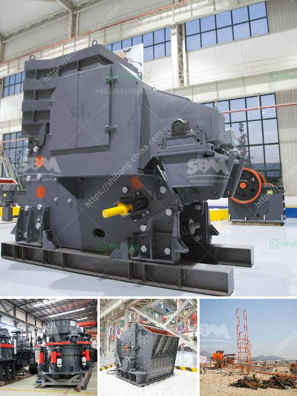

<h3>copper concentrate processing equipment</h3>
Copper is one of the most widely used metals in our daily lives, and copper concentrate is an important intermediate product used in the production of copper metal. Copper concentrate processing equipment is also a key component to improve the grade of copper concentrate.

Copper concentrates are produced by the beneficiation or upgrading of copper ore. A typical copper ore would be 0.7% to 2% copper, a typical copper concentrate would grade around 25% to 35% copper. Copper concentrates are either smelted and refined in-house, or sold to custom smelters. The concentrate may be smelted to produce blister copper for sale to a custom refinery, or the blister copper may be refined to cathode, which is then sold into the market. Copper concentrate processing equipment is needed in the flotation process.

Firstly, the copper concentrate minerals mainly include chalcopyrite (CuFeS2), chalcocite (Cu2S), bornite (Cu5FeS4), and covellite (CuS), etc. Copper ore is mostly oxidized ore and contains only 0.6% to 1% copper. Therefore, the copper concentrate grade is relatively low, about 25% to 35%, which consists of 59% to 69% sulfide copper, and 10% to 20% oxidized copper. Therefore, flotation is a common processing method to process copper sulfide ore. Here, the copper concentrate processing equipment needed includes the copper ore crushing equipment, grinding equipment, and jigging equipment.

Firstly, the copper ore is crushed and grinded into fine particles for further processing. The finely crushed copper-bearing particles are concentrated in a flotation tank, and then the copper conentrate is roasted and smelted.

In the copper concentrate flotation process, the ore is usually crushed and ground to a certain particle size, so that the useful minerals in the ore can achieve sufficient monomer dissociation. According to the ore properties and plant location, Xinhai selected hammer crusher machine for client. The crusher inside is increased grate adjustment device, which can adjust grate gap according to customer requirements, change the discharging granularity, achieving multi-usage, saving manpower, material resources and financial resources.

Copper ore grinding stage refers to the grinding particle size of the copper ore is gradually reduced to a certain particle size, which is to facilitate the subsequent separation, and to enrich copper in the concentrate. Here, we use more processing equipment, such as vertical grinding mill and trapezium mill, which mainly improve the grinding ability and meet the requirements of copper ore particles.

In order to improve the grade of copper concentrate, the tails of flotation process mainly go through the gravity separation process. While copper concentrates with large granules and high iron content may adopt a low-intensity magnetic separation process.

In summary, copper concentrate processing equipment mainly includes jaw crusher, cone crusher, impact crusher, vertical grinding mill, trapezium mill, flotation machine, jigging machine, mixing drum, thickener, and other equipment. Copper concentrate is an important intermediate product in the production of copper metal, and the copper concentrate processing equipment is the key to improve its grade.
<h3>Contact us</h3><ul><li><strong>Whatsapp:&nbsp;<a href="https://wa.me/8613661969651">+8613661969651</a></strong></li><li><a href="https://swt.shibang-china.com/?git&amp;zhl&amp;copper concentrate processing equipment"><strong>Online Service(chat now)</strong></a></li></ul><h3>Related</h3><ul><li><a href='stone crushing industry tanzania.md'>stone crushing industry tanzania</a></li><li><a href='cone crusher contractors in egypt.md'>cone crusher contractors in egypt</a></li><li><a href='prices for stone crushing machine south africa.md'>prices for stone crushing machine south africa</a></li><li><a href='fine grinding mill for sale.md'>fine grinding mill for sale</a></li><li><a href='crusher price in nepal.md'>crusher price in nepal</a></li></ul>