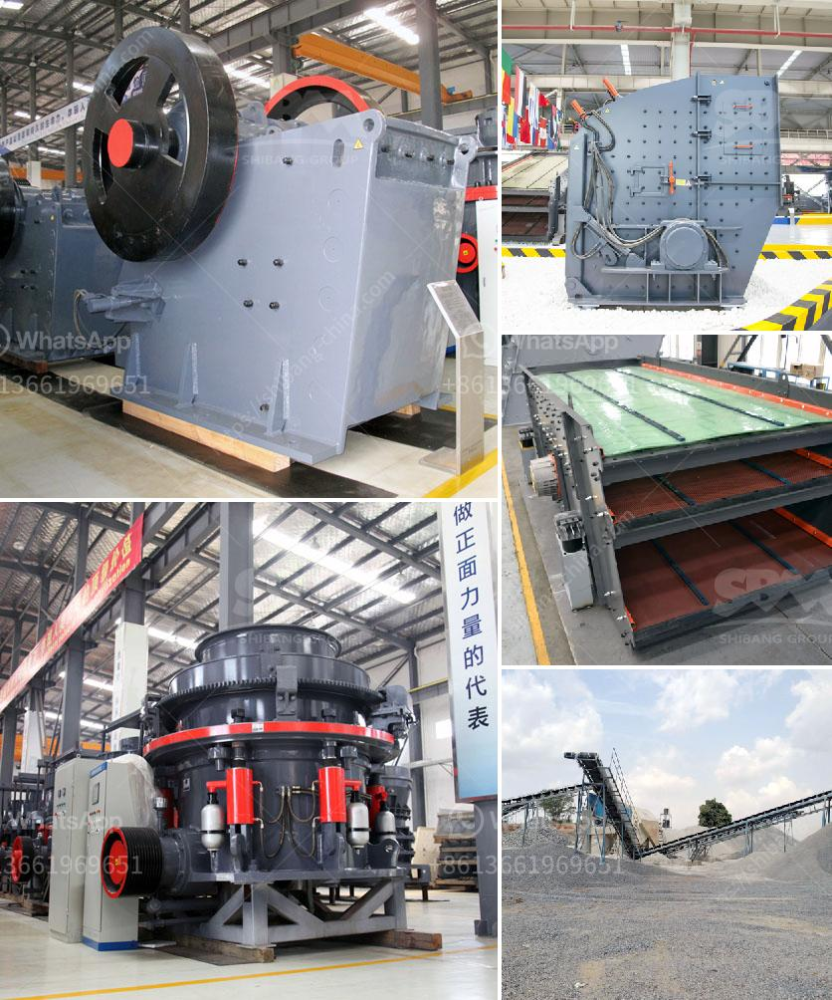

<h3>copper grind powder mill machine</h3>
Metal enthusiasts and DIY enthusiasts alike understand the significance of having the right tools to work with. One such tool that should be present in every metalworking shop is the copper grind powder mill machine. This machine is essential for grinding copper into a fine powder, making it more manageable for various applications. Let's delve deeper into the uses and benefits of the copper grind powder mill machine.

First and foremost, what exactly is a copper grind powder mill machine? It is a device that crushes copper materials into fine powder form using mechanical force. Commonly known as copper grinding mills, these machines feature a rotating drum with steel balls inside. As the drum rotates, the balls collide with and crush the copper ore, reducing it to a powder-like consistency.

One of the key uses of copper grind powder mill machines is in the manufacturing of copper-based products. Copper, due to its excellent electrical conductivity and corrosion resistance, is widely used in various industries, including electronics, plumbing, and construction. However, working with solid copper can be challenging, especially when specific dimensions or intricate designs are required. By converting copper into powder form, it becomes easier to mold or shape it according to specific needs.

In addition to manufacturing, copper grind powder mill machines also find applications in the metallurgical industry. Copper powder is utilized as a feedstock material for powder metallurgy, a technique that involves compacting and sintering metal powders to create complex shapes or components. Powder metallurgy offers numerous advantages, including cost-effectiveness, design flexibility, and the ability to produce intricate parts that are difficult or impossible to create through traditional machining methods. Copper powder made using grind powder mill machines is an essential ingredient in this process.

Furthermore, copper powder produced by copper grind powder mill machines plays a crucial role in the production of thermal electric conductive pastes. These pastes are used in electronic devices to enhance heat dissipation and ensure optimum performance. By incorporating copper powder into pastes, manufacturers can improve the thermal conductivity of electronic components while ensuring reliable operation, even under high heat conditions. Without the copper grind powder mill machine, it would be challenging to produce fine copper powder consistently for these applications.

Overall, the copper grind powder mill machine is a must-have for metal enthusiasts looking to work with copper efficiently. It enables the conversion of solid copper into fine powder, expanding its potential uses in various industries. Whether it is manufacturing copper-based products, utilizing copper powder in powder metallurgy, or enhancing the thermal conductivity of electronic devices, this machine proves its worth. The ability to transform copper from a solid to a powder form opens up endless possibilities for creativity and innovation in the metalworking field.

In conclusion, the copper grind powder mill machine is more than just a tool – it unlocks the true potential of copper as a metal. Its ability to crush copper into fine powder form allows for enhanced workability, enabling a wide range of applications in manufacturing, metallurgy, and electronics. For anyone working with copper, this machine is undoubtedly a valuable asset and an essential addition to any metalworking shop.
<h3>Contact us</h3><ul><li><strong>Whatsapp:&nbsp;<a href="https://wa.me/8613661969651">+8613661969651</a></strong></li><li><a href="https://swt.shibang-china.com/?git&amp;zhl&amp;copper grind powder mill machine"><strong>Online Service(chat now)</strong></a></li></ul><h3>Related</h3><ul><li><a href='clay crusher manufacturing process.md'>clay crusher manufacturing process</a></li><li><a href='pioneer ve rock crusher.md'>pioneer ve rock crusher</a></li><li><a href='coal mill pulverizer in thermal power plant.md'>coal mill pulverizer in thermal power plant</a></li><li><a href='manufacturer of vibrating screens.md'>manufacturer of vibrating screens</a></li><li><a href='mobile stone crusher machine price and cost.md'>mobile stone crusher machine price and cost</a></li></ul>