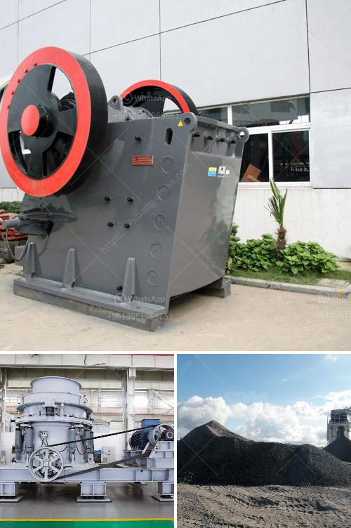

<h3>copper ore complete concentrating method</h3>
Copper is one of the widely used metals in various industries due to its excellent electrical conductivity, thermal conductivity, and resistance to corrosion. However, copper does not occur naturally in its pure form but is usually found as a combination of copper and other minerals in the form of copper ore.

In order to extract copper from its ore, several beneficiation processes are employed to remove unwanted materials and focus on obtaining a concentrated form of copper. The complete concentrating method involves a series of steps that are aimed at separating valuable copper minerals from other minerals and impurities.

The first step in the concentrating method is crushing and grinding the mined copper ore into a fine powder. This process facilitates the liberation of valuable copper minerals from the surrounding rock. The crushed ore is then subjected to a series of physical and chemical processes.

The next step is called froth flotation, which uses the properties of copper minerals to separate them from other minerals and impurities. In this process, the finely ground copper ore is mixed with water and chemicals called collectors. These collectors selectively attach to the copper particles, making them hydrophobic, or water-repellent.

Air bubbles are then introduced into the mixture, and the hydrophobic copper particles attach themselves to the air bubbles. This forms a froth on top of the flotation cell, which contains the concentrated copper minerals. The froth is then skimmed off, and the copper concentrate is collected.

The obtained copper concentrate still contains impurities such as sulfur, iron, and other unwanted elements. To further purify the copper concentrate, it undergoes a process called smelting. During smelting, the copper concentrate is heated to high temperatures in a furnace along with a reducing agent such as coke or charcoal.

The high temperatures and reducing agents cause the unwanted impurities to react and form a slag, which floats on top of the molten copper. The slag is then removed, leaving behind purified molten copper. This molten copper is further processed and cooled to obtain solid copper in the form of ingots or other shapes, ready for further manufacturing processes.

In addition to froth flotation and smelting, other techniques such as magnetic separation, gravity separation, and leaching may be employed in the complete concentrating method, depending on the specific properties of the copper ore and the desired final product.

Overall, the complete concentrating method for copper ore involves a series of physical and chemical processes aimed at separating valuable copper minerals from other minerals and impurities. This method ensures the extraction of copper in a concentrated form, which can then be used in various industries, including electronics, construction, and transportation. Copper plays a crucial role in modern society, and its efficient extraction and concentration are essential for meeting the increasing global demand.
<h3>Contact us</h3><ul><li><strong>Whatsapp:&nbsp;<a href="https://wa.me/8613661969651">+8613661969651</a></strong></li><li><a href="https://swt.shibang-china.com/?git&amp;zhl&amp;copper ore complete concentrating method"><strong>Online Service(chat now)</strong></a></li></ul><h3>Related</h3><ul><li><a href='full crushing plants germiston.md'>full crushing plants germiston</a></li><li><a href='earthen clay products manufacturing process.md'>earthen clay products manufacturing process</a></li><li><a href='cost of a manganese processing plant in south africa.md'>cost of a manganese processing plant in south africa</a></li><li><a href='mobile diamond washing plant for sale.md'>mobile diamond washing plant for sale</a></li><li><a href='granite quarrying process.md'>granite quarrying process</a></li></ul>