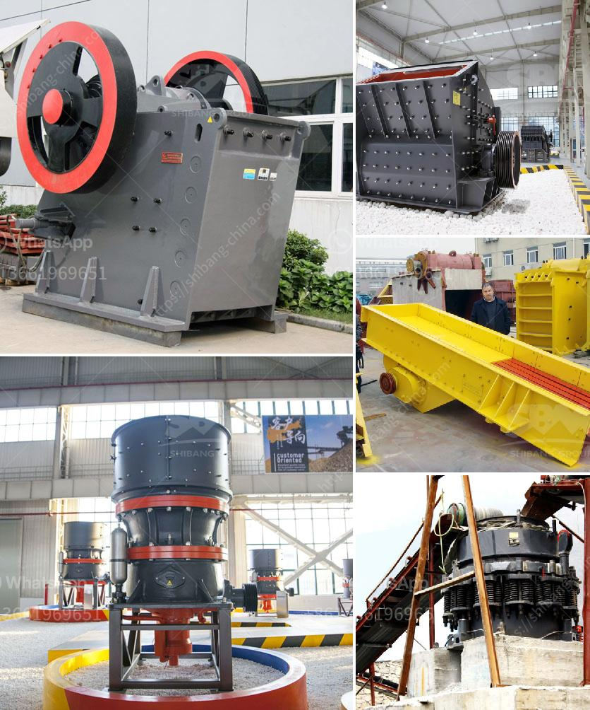

<h3>copper ore crushing plant in chile</h3>
Copper ore is one of the most widely used ores in industries, including construction, metallurgy, electronics, and transportation. Chile, a South American country known for its copper production, hosts significant copper deposits in its northern regions. As a result, the country is recognized as a key player in global copper production. In order to extract and process copper ore efficiently, Chile has established several copper ore crushing plants.

Copper ore crushing plants in Chile combine the benefits of traditional stationary crushers with the versatility of mobile crushers. These innovative crushing plants provide unparalleled flexibility and efficiency, allowing significant reductions in processing costs and environmental impacts.

The copper ore crushing plants in Chile are highly automated and equipped with cutting-edge technology, providing operators with an efficient and safe working environment. The plants consist of a primary crushing station, which feeds the ore to a secondary crushing station, where it is further crushed and prepared for transport. This ensures a consistent feed size to the grinding circuit, optimizing copper recovery rates during the subsequent processing stages.

In addition to their technological advancements, these crushing plants also prioritize sustainability. They are designed to minimize energy consumption and reduce greenhouse gas emissions, aligning with Chile's commitment to environmental stewardship. This focus on sustainability is further reinforced through the implementation of water recycling systems, minimizing water usage during the crushing process.

The copper ore crushing plants in Chile play a critical role in maintaining a stable supply of copper to meet global demands. Copper is an essential component in various industries, including electrical equipment, telecommunications, and renewable energy technologies. Therefore, the productivity and efficiency of these crushing plants directly impact the overall availability and affordability of copper products worldwide.

In conclusion, Chile's copper ore crushing plants are vital for both the country's economy and the global copper industry. With their advanced technology and sustainable practices, these plants contribute significantly to the efficient extraction and processing of copper ore, supporting the growth of various industries. By investing in these innovative crushing plants, Chile continues to solidify its position as a key player in global copper production.
<h3>Contact us</h3><ul><li><strong>Whatsapp:&nbsp;<a href="https://wa.me/8613661969651">+8613661969651</a></strong></li><li><a href="https://swt.shibang-china.com/?git&amp;zhl&amp;copper ore crushing plant in chile"><strong>Online Service(chat now)</strong></a></li></ul><h3>Related</h3><ul><li><a href='dolomite beneficiation process.md'>dolomite beneficiation process</a></li><li><a href='products scm ultrafine mill.md'>products scm ultrafine mill</a></li><li><a href='price list of cone crushers made in china.md'>price list of cone crushers made in china</a></li><li><a href='crusher for silicon quartz.md'>crusher for silicon quartz</a></li><li><a href='dorries vertical grinders used for sale europe.md'>dorries vertical grinders used for sale europe</a></li></ul>