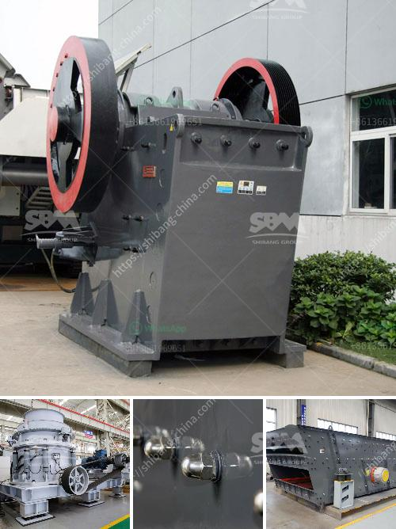

<h3>copper ore processing plants in pakistan</h3>
Copper is a highly valued and utilized metal that plays a pivotal role in various industries, including electronics, construction, and transportation. Pakistan is blessed with abundant reserves of copper ore, particularly in the western part of the country. With the growing demand for copper at the national and global levels, the establishment of copper ore processing plants in Pakistan will significantly contribute to the country's socio-economic development.

Copper ore processing involves various stages of operations, including excavation, crushing, milling, smelting, refining, and casting. Initially, large-scale mining operations will remove the copper-bearing ore from the ground and transport it to a nearby processing facility. The ore will undergo crushing and grinding processes to reduce its size and facilitate the separation of copper-rich minerals from other rock formations.

Once the ore is ground into smaller particles, it will undergo a flotation process. Flotation is a widely used technique in which the pulverized ore is mixed with water and chemicals, including frothers and collectors. The copper minerals attach to air bubbles, which are introduced into the flotation cells. The bubbles rise to the surface, while unwanted minerals sink. This process enables the separation of copper concentrate, which contains a high percentage of copper, from the rest of the gangue minerals.

After flotation, the copper concentrate is further processed through a series of steps to remove impurities and increase the copper content. This refined copper concentrate is then smelted in a furnace, converting it into a copper matte. The matte is subsequently transferred to a converter, where the remaining impurities, such as iron and sulfur, are oxidized and removed, leaving behind a blister copper. This blister copper can be further refined through electrolysis to produce high-purity copper cathodes, which are used in various industrial applications.

The establishment of copper ore processing plants in Pakistan will not only reduce the country's dependence on imports but also create employment opportunities for the local population and stimulate economic growth and development. The resulting copper concentrate and refined copper products can be exported to international markets, thereby generating foreign exchange and strengthening Pakistan's industrial sector.

Furthermore, the presence of copper processing plants will attract foreign direct investment (FDI) in the mining sector. International mining companies, equipped with advanced technology and expertise, can partner with local stakeholders to explore and exploit Pakistan's rich copper resources. This collaboration will not only bolster technical knowledge transfer but also improve environmental and safety standards in the mining and processing of copper ore.

In conclusion, the establishment of copper ore processing plants in Pakistan holds immense potential for economic growth, job creation, and technological advancements. The country's ample reserves of copper ore, coupled with its strategic location and access to international markets, position Pakistan as an attractive destination for investment in the mining sector. By harnessing the copper resources effectively, Pakistan can reduce its import bill and boost its industrial productivity, contributing to sustainable development and prosperity.
<h3>Contact us</h3><ul><li><strong>Whatsapp:&nbsp;<a href="https://wa.me/8613661969651">+8613661969651</a></strong></li><li><a href="https://swt.shibang-china.com/?git&amp;zhl&amp;copper ore processing plants in pakistan"><strong>Online Service(chat now)</strong></a></li></ul><h3>Related</h3><ul><li><a href='stone crushing prices.md'>stone crushing prices</a></li><li><a href='construction construction belt.md'>construction construction belt</a></li><li><a href='mica processing plant.md'>mica processing plant</a></li><li><a href='ethiopia rock crusher.md'>ethiopia rock crusher</a></li><li><a href='stone crusher maker in india.md'>stone crusher maker in india</a></li></ul>