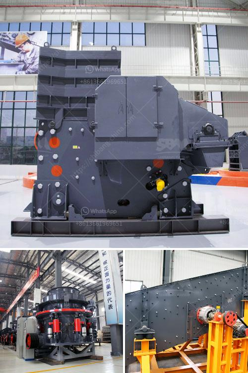

<h3>copper ore processing</h3>
Copper is among the most abundant and widely used metals in the world. Its widespread applications extend across numerous industries, including electrical wiring, plumbing, and electronics. To meet the growing demand for copper, efficient copper ore processing is needed. In this article, we will explore the process of copper ore processing and its key steps.

Firstly, copper ore is mined from underground or open-pit mines, depending on the location and accessibility of the ore body. Once extracted, the ore is transported to a processing plant where it undergoes several stages to obtain pure copper.

The first step in the copper ore processing is crushing and grinding the ore to a fine powder. This prepares it for further processing, such as leaching and flotation. Crushing and grinding are energy-intensive processes that consume a significant amount of electricity.

After the ore is crushed, it is then ground to a fine powder in grinding mills. The grinding process helps to liberate the copper minerals from the surrounding rock and make them more accessible for further separation.

The next step in the copper ore processing is leaching. This process involves the use of chemical solutions to dissolve the copper minerals from the ore. Depending on the ore type and desired copper concentration, different leaching methods such as heap leaching, vat leaching, or agitation leaching may be employed. During leaching, the copper minerals dissolve into the leach solution, leaving behind the impurities.

Once the copper minerals are leached into the solution, the next step is to recover the copper. This is done through a process called solvent extraction-electrowinning (SX-EW). In this process, the leach solution is passed through organic compounds that selectively bind with copper ions. These copper-loaded organic compounds are then stripped of copper ions, which are subsequently recovered electrolytically. This electrowinning process results in the production of high-purity copper cathodes, which can be used directly or further processed into various copper products.

In addition to leaching and SX-EW, flotation is another important step in copper ore processing. Flotation is a physical separation process where different minerals, including copper, are selectively separated from the ore based on their surface properties. In this process, the finely ground ore is mixed with water and various reagents, which promote the attachment of air bubbles to the copper minerals, allowing them to rise to the surface and be collected as a concentrate.

After the flotation process, the obtained copper concentrate undergoes further processing to remove impurities and increase the copper content. This typically involves smelting and refining, where the concentrate is heated in a furnace to separate copper from other metals and remove any remaining impurities. The resulting copper anodes are then refined through electrolysis to produce high-grade copper cathodes.

In conclusion, copper ore processing involves a series of stages that transform the mined ore into valuable copper products. From crushing and grinding to leaching, flotation, and refining, each step plays a crucial role in obtaining pure copper. With the increasing demand for copper, optimizing the copper ore processing methods is imperative to ensure efficient and sustainable production.
<h3>Contact us</h3><ul><li><strong>Whatsapp:&nbsp;<a href="https://wa.me/8613661969651">+8613661969651</a></strong></li><li><a href="https://swt.shibang-china.com/?git&amp;zhl&amp;copper ore processing"><strong>Online Service(chat now)</strong></a></li></ul><h3>Related</h3><ul><li><a href='price of stone crusher stone crusher.md'>price of stone crusher stone crusher</a></li><li><a href='argentine hammer mills.md'>argentine hammer mills</a></li><li><a href='crushing machine from china.md'>crushing machine from china</a></li><li><a href='russia stone crusher.md'>russia stone crusher</a></li><li><a href='hammer mill for concentrate price.md'>hammer mill for concentrate price</a></li></ul>