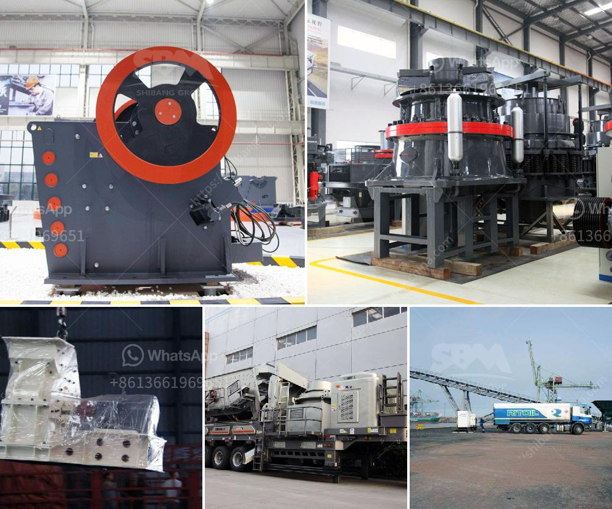

<h3>copper ore quarry equipment manufacturer in thailand</h3>
Thailand holds a prominent position as a leading manufacturer and exporter of various industrial products. One of the key industries that contribute significantly to the country's economy is the mining sector. Copper mining is one of the vital industries that propel Thailand's economic growth.

A crucial aspect of copper mining is quarrying, where large deposits of copper ore are extracted from the earth's crust for further processing. To meet the growing demand for copper, companies in Thailand rely on high-quality equipment from reliable manufacturers. One of the notable copper ore quarry equipment manufacturers in Thailand is committed to delivering superior mining equipment and machinery to clients across the globe.

These manufacturers understand the unique requirements of the copper mining industry and provide cutting-edge equipment to enhance operational efficiency and productivity. They offer a wide range of equipment specifically designed for copper mining applications, including crushers, grinders, flotation machines, magnetic separators, and more.

The quarry equipment manufactured by these companies is known for its durability, reliability, and high performance. Advanced technologies used in the equipment ensure efficient copper ore extraction and processing while minimizing environmental impact. These manufacturers also prioritize safety and adhere to stringent international standards.

With their extensive experience, these manufacturers provide comprehensive solutions tailored to the specific needs of copper mining operations. They offer equipment customization services, maintenance support, and timely delivery to ensure smooth mining operations.

In addition to serving the local mining industry, these manufacturers also export their equipment to international markets, further facilitating Thailand's role in the global copper mining sector. Their commitment to innovation and continuous improvement ensures that they remain at the forefront of the industry.

In conclusion, the presence of a reputable copper ore quarry equipment manufacturer in Thailand is instrumental in driving the growth of the country's mining sector. Their technologically advanced equipment, customization services, and commitment to sustainability contribute significantly to the success of the copper mining industry both locally and globally.
<h3>Contact us</h3><ul><li><strong>Whatsapp:&nbsp;<a href="https://wa.me/8613661969651">+8613661969651</a></strong></li><li><a href="https://swt.shibang-china.com/?git&amp;zhl&amp;copper ore quarry equipment manufacturer in thailand"><strong>Online Service(chat now)</strong></a></li></ul><h3>Related</h3><ul><li><a href='bhel coal mill spares manufacturers.md'>bhel coal mill spares manufacturers</a></li><li><a href='rock crusher for excavator.md'>rock crusher for excavator</a></li><li><a href='price for stone crusher machine.md'>price for stone crusher machine</a></li><li><a href='famous stone crushing equipment supplier in china.md'>famous stone crushing equipment supplier in china</a></li><li><a href='rock sand plant feasibility report.md'>rock sand plant feasibility report</a></li></ul>