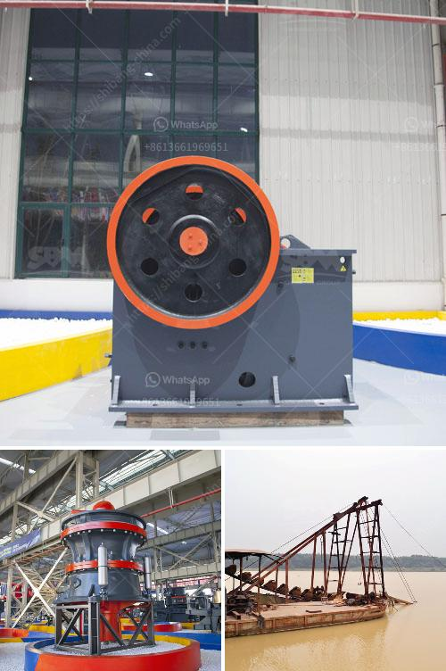

<h3>copper processing equipment</h3>
Copper is a versatile metal that has been used for various purposes for thousands of years. From electrical wiring to plumbing systems, copper plays a crucial role in our daily lives. However, before it can be utilized, copper ore must go through a complex process called copper processing.

Copper processing equipment is necessary in this intricate process. From hauling raw ore to smelting and refining, the equipment used in this process is vital for efficient and effective extraction of copper.

One of the key pieces of equipment used in copper processing is a crusher. Copper ore is first broken into smaller pieces by a crusher, which is then sent to grinding mills to further reduce the size and ensure proper liberation of copper minerals trapped within the ore. After grinding, the ore is then sent to a flotation cell, where the copper minerals are separated from the rest of the ore particles.

Another essential piece of equipment used in copper processing is a thickener. Thickening is the process of separating solids from liquids by increasing the concentration of the solids. In copper processing, thickeners are used to separate the solids from the liquid in the final stage of the process. This allows for easier handling and transportation of the concentrated copper solution.

Other equipment used in copper processing include agitators, filters, and driers. Agitators are used in the flotation cell to ensure the proper mixing of chemicals and ore particles. Filters are used to remove impurities from the copper solution, and driers are used to remove excess water from the final copper concentrate.

In conclusion, copper processing equipment is necessary to ensure the efficient and effective extraction of copper from raw ore. Crushers, grinding mills, flotation cells, thickeners, agitators, filters, and driers are all essential pieces of equipment used in the copper processing process. Without these equipment, copper processing would be an arduous and time-consuming task. Thanks to modern advancements in technology, copper processing has become more cost-effective and environmentally friendly.
<h3>Contact us</h3><ul><li><strong>Whatsapp:&nbsp;<a href="https://wa.me/8613661969651">+8613661969651</a></strong></li><li><a href="https://swt.shibang-china.com/?git&amp;zhl&amp;copper processing equipment"><strong>Online Service(chat now)</strong></a></li></ul><h3>Related</h3><ul><li><a href='portable concrete crusher south africa.md'>portable concrete crusher south africa</a></li><li><a href='aggregates crusher cebu.md'>aggregates crusher cebu</a></li><li><a href='listing price tons per hour screw conveyor.md'>listing price tons per hour screw conveyor</a></li><li><a href='uses jaw crusher in kenya.md'>uses jaw crusher in kenya</a></li><li><a href='crusher stone manufacturers.md'>crusher stone manufacturers</a></li></ul>