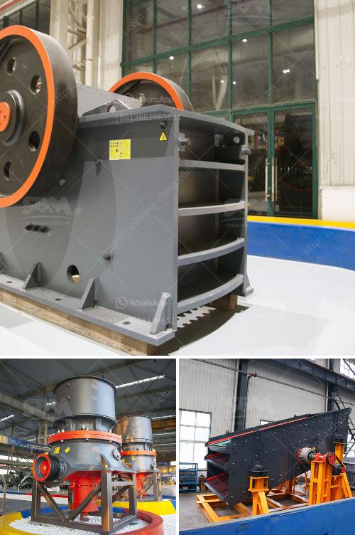

<h3>cornerstone equipment inc used rock crushers</h3>
When it comes to breaking down different types of materials, such as rock, gravel, or concrete, crushers are indispensable. These powerful machines are designed to crush large rocks into smaller ones, making them more manageable for various construction and industrial applications. For those in need of reliable and high-performing rock crushers, Cornerstone Equipment Inc offers a range of used crushers that meet different crushing requirements.

Cornerstone Equipment Inc is a family-owned and operated company based in Texas, USA. With over 30 years of experience in the industry, they have built a strong reputation for providing top-quality used rock crushers. Their extensive inventory includes a wide range of models from reputable manufacturers like Cedarapids, El-Jay, and Eagle.

Whether you are looking for a primary jaw crusher for quarrying operations or a cone crusher for secondary crushing, Cornerstone Equipment Inc has a used rock crusher that will meet your needs. Their experienced team of professionals will guide you through the selection process and help you find the right machine for your specific application.

What sets Cornerstone Equipment Inc apart is their commitment to customer satisfaction. They understand that each customer has unique requirements and budgets, so they work closely with them to find the best crushing solution. With their vast knowledge and expertise, they can help clients choose the right equipment that maximizes productivity and minimizes downtime.

In addition to their used rock crushers, Cornerstone Equipment Inc offers a variety of related products and services, such as wear parts, wear liners, filters, and more. They also provide on-site training and technical support, ensuring that their customers are equipped with the necessary knowledge to operate and maintain their machines effectively.

Investing in used rock crushers from Cornerstone Equipment Inc is not just a cost-effective solution but also a smart one. With their wide selection of reliable and well-maintained crushers, customers can save on capital expenses and still achieve the desired results. Additionally, their commitment to quality and customer satisfaction ensures that customers receive the best value for their investment.

In conclusion, Cornerstone Equipment Inc is a trustworthy source for used rock crushers that deliver exceptional performance and reliability. Whether you need a primary jaw crusher or a cone crusher for secondary crushing, their extensive inventory and knowledgeable team will assist you in finding the right machine for your application. With their dedication to customer satisfaction and excellent after-sales support, Cornerstone Equipment Inc is the go-to destination for all your rock crushing needs.
<h3>Contact us</h3><ul><li><strong>Whatsapp:&nbsp;<a href="https://wa.me/8613661969651">+8613661969651</a></strong></li><li><a href="https://swt.shibang-china.com/?git&amp;zhl&amp;cornerstone equipment inc used rock crushers"><strong>Online Service(chat now)</strong></a></li></ul><h3>Related</h3><ul><li><a href='iron ore beneficiation proposal.md'>iron ore beneficiation proposal</a></li><li><a href='hammer mill crusher.md'>hammer mill crusher</a></li><li><a href='roller crusher equipment supplier.md'>roller crusher equipment supplier</a></li><li><a href='mobile stone crushing machine in america.md'>mobile stone crushing machine in america</a></li><li><a href='mobile gold refinery for sale.md'>mobile gold refinery for sale</a></li></ul>