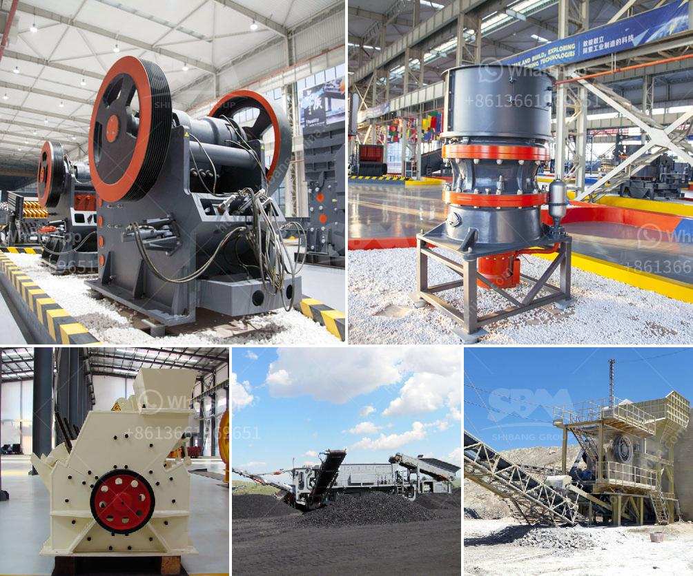

<h3>cost cost of bauxite mining equipments</h3>
The mining industry is known for its high risk and high reward nature. The extraction of minerals from the earth often involves substantial investments in equipment, infrastructure, and manpower. Bauxite, a sedimentary rock known for its high aluminum content, is one of the principal ores used as raw material in the production of aluminum.

The process of extracting bauxite involves drilling, blasting, crushing, and transporting the ore from the mines to the refineries. The first and foremost requirement for mining bauxite is the equipment needed for excavating and transporting the ore. This becomes even more important when the ore is located in remote areas, far from the refineries.

The most common equipment used in bauxite mining are excavators, draglines, bulldozers, trucks, and crushers. These machines are used to break and transport the ore to the refineries. Due to the high capital costs involved in purchasing and maintaining this equipment, many mining companies outsource the extraction process to external contractors.

The cost of mining equipment is just one factor out of many that determine the overall cost of bauxite mining. For instance, labor costs, energy costs, and environmental regulations all play a crucial role in shaping the economics of mining. Additionally, the quality and grade of bauxite deposits also impacts the profitability of the mining operation.

The price of mining equipment can vary greatly depending on factors such as the size and capacity of the machines, the specific requirements of the mine, and the location. For instance, an excavator used in a small-scale mining operation may cost around $150,000, while a large-scale operation may require equipment worth millions of dollars. Similarly, a haul truck used for transporting the ore could cost anywhere between $200,000 and $500,000.

In addition to the initial purchase cost, there are also ongoing expenses associated with bauxite mining equipment. Maintenance, repair, and replacement costs are inevitable, as these heavy machines are subject to wear and tear. Furthermore, fuel consumption, lubricants, and spare parts contribute to the overall operating costs.

It is worth noting that obtaining financing for equipment purchases can be challenging for mining companies, particularly for those with limited financial resources. This is because lenders often consider mining ventures as high-risk investments due to the uncertainties involved, such as fluctuating commodity prices and geopolitical factors. Therefore, mining companies may have to resort to various financing options, including leasing, to acquire the necessary equipment.

Overall, the cost of bauxite mining equipment should be considered in the broader context of the entire mining operation. While equipment costs play a significant role, they need to be balanced with other cost factors to determine the viability and profitability of the project. Moreover, mining companies must also comply with environmental regulations and social responsibilities, which may introduce additional costs or impact the choice of mining methods.

In conclusion, the cost of bauxite mining equipment depends on various factors including the size and capacity of the machines, the specific requirements of the mine, and its location. While the cost of purchasing and maintaining the equipment can be significant, it is important to consider these expenses in relation to the overall economics of the mining operation.
<h3>Contact us</h3><ul><li><strong>Whatsapp:&nbsp;<a href="https://wa.me/8613661969651">+8613661969651</a></strong></li><li><a href="https://swt.shibang-china.com/?git&amp;zhl&amp;cost cost of bauxite mining equipments"><strong>Online Service(chat now)</strong></a></li></ul><h3>Related</h3><ul><li><a href='conveyor supplier in the philippines.md'>conveyor supplier in the philippines</a></li><li><a href='granite stones crusher.md'>granite stones crusher</a></li><li><a href='jaw crusher 10 x 20.md'>jaw crusher 10 x 20</a></li><li><a href='size to a jaw crusher and cone crusher.md'>size to a jaw crusher and cone crusher</a></li><li><a href='mining equipment chrome concentrate in turkey.md'>mining equipment chrome concentrate in turkey</a></li></ul>