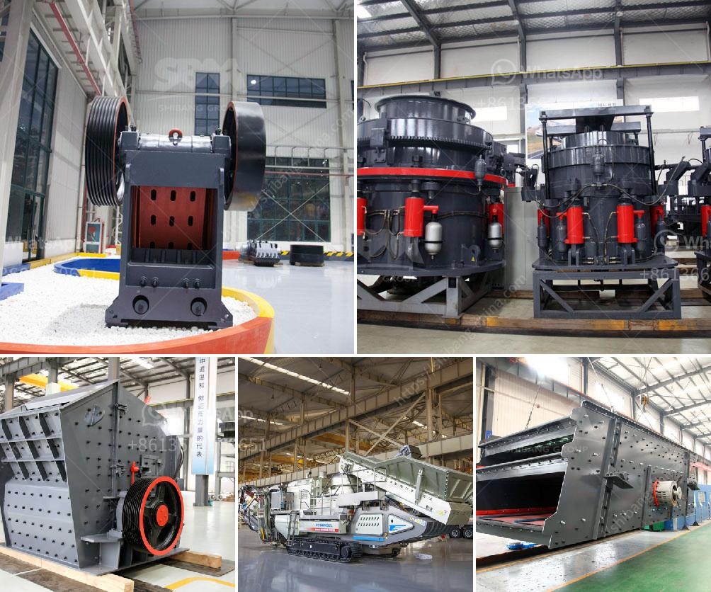

<h3>cost of 5 000 tpd cement project ore processing</h3>
The cost of a 5,000 TPD cement project ore processing can vary depending on several factors. This article aims to explore these factors and provide a comprehensive analysis of the estimated cost for such a project.

One of the major factors determining the cost of a cement project is the size of the plant and the production capacity. A 5,000 TPD (tons per day) ore processing plant is considered to be a relatively large scale plant in the cement industry. The ore processing plant involves various processes, including crushing, grinding, and ore separation, which require substantial machinery and equipment.

The equipment required for the ore processing plant can be a significant cost factor. Crushers, mills, and separators are some of the essential machinery utilized in the processing of ore. The cost of these machines can vary depending on their capacity and quality. Additionally, the specific requirements of the project, such as the type of ore being processed, can also impact the choice of machinery and consequently, the cost.

Along with the equipment cost, the cost of infrastructure and civil construction must be taken into consideration. A cement project of this scale requires substantial land area for setting up the plant, storage facilities, and other necessary infrastructure. The cost of acquiring the land and developing the required infrastructure can be substantial and needs to be factored into the overall cost of the project.

Another significant factor contributing to the cost is the energy required for the ore processing plant. Cement production is known to be an energy-intensive process. The energy requirement mainly comes from the grinding of the raw materials and the drying of the processed ore. The cost of electricity or fossil fuels needed to power the plant can significantly impact the overall cost of the project.

Moreover, the cost of labor and operational overheads should not be overlooked. A project of this scale requires a skilled workforce to operate the machinery, manage the plant, and perform regular maintenance. The cost of hiring skilled personnel and their associated benefits will add to the overall project cost.

Furthermore, transportation costs can be a significant factor in the cost of a cement project. The specific location of the project can impact the costs associated with transporting raw materials, fuel, and the final product. If the site is located far from the source of materials or distribution channels, the transportation costs can increase exponentially.

It is challenging to provide a precise cost estimate for a 5,000 TPD cement project ore processing without specific project details. However, as a rough estimate, a project of this scale can range from $100 million to $300 million, depending on the factors mentioned above.

In conclusion, the cost of a 5,000 TPD cement project ore processing is influenced by various factors such as the size of the plant, equipment requirements, infrastructure, energy consumption, labor costs, and transportation expenses. These factors must be carefully considered and accounted for during the project planning to ensure accurate cost estimates.
<h3>Contact us</h3><ul><li><strong>Whatsapp:&nbsp;<a href="https://wa.me/8613661969651">+8613661969651</a></strong></li><li><a href="https://swt.shibang-china.com/?git&amp;zhl&amp;cost of 5 000 tpd cement project ore processing"><strong>Online Service(chat now)</strong></a></li></ul><h3>Related</h3><ul><li><a href='used rock roll crusher.md'>used rock roll crusher</a></li><li><a href='project cost to manufacture 200 tpd cement in in nepal.md'>project cost to manufacture 200 tpd cement in in nepal</a></li><li><a href='crusher for iron ore.md'>crusher for iron ore</a></li><li><a href='ultrafine pulverizer.md'>ultrafine pulverizer</a></li><li><a href='sell plant crusher of stone.md'>sell plant crusher of stone</a></li></ul>