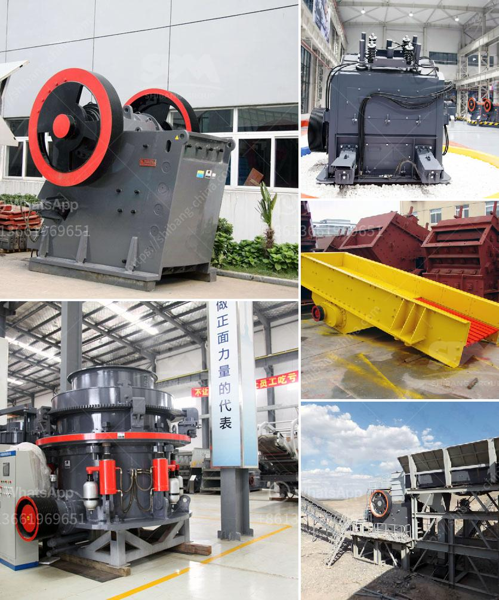

<h3>cost of a conveyor belt systems for mining</h3>
Mining companies are always on the lookout for ways to cut costs and improve efficiency. This brings a focus on equipment that is both reliable and cost-effective. One such solution that is gaining popularity in the mining industry is the use of conveyor belt systems.

Conveyor belt systems offer numerous advantages in the mining industry, such as reducing labor costs, shortening transportation times, and improving overall efficiency. However, it is essential to consider the cost implications before investing in such a system.

The cost of a conveyor belt system for mining varies greatly on several factors, including the type of conveyor selected, the length and width of the belt, the required horsepower, and the necessary accessories. These factors can influence the overall cost of the system significantly.

The type of conveyor belt system chosen plays a crucial role in determining the cost. There are various types available, such as belt conveyors, apron conveyors, chain conveyors, and screw conveyors. Each type has its own advantages and disadvantages and comes at a different price point. Comparing the features and benefits of different systems will help determine the best fit for a mining operation.

The length and width of the conveyor belt also impact the cost. Longer belts typically cost more due to the materials required, manufacturing complexity, and additional support structures needed. Similarly, wider conveyor belts can also be more expensive as they require more materials and may need additional power to operate effectively.

Horsepower is another important consideration when evaluating the cost of a conveyor belt system. Higher horsepower is required for longer and wider belts, heavy-duty materials, and steep inclines. The higher the horsepower, the more expensive the system will be, both in terms of the initial investment and ongoing operating costs.

Accessories, such as safety guards, covers, and monitoring systems, are essential for ensuring the smooth and safe operation of the conveyor belt system. These accessories not only impact the cost but also play a critical role in reducing maintenance and repair expenses in the long run. It is advisable to invest in high-quality accessories to avoid costly breakdowns and work stoppages.

In addition to the initial purchase cost, mining companies should also consider ongoing operational expenses, such as maintenance, repairs, and energy consumption. Selecting a reliable and durable system may have a higher upfront cost but can result in significant savings in the long term.

Lastly, it is crucial to consider the overall return on investment (ROI) when evaluating the cost of a conveyor belt system. Increased efficiency and productivity resulting from reduced labor costs, shortened transportation times, and improved processes can outweigh the initial investment.

In conclusion, the cost of a conveyor belt system for mining can vary widely depending on factors such as the type of system, the length and width of the belt, the required horsepower, and necessary accessories. Mining companies should carefully evaluate these factors, as well as ongoing operational expenses and potential ROI, to make an informed decision. A well-designed and efficient conveyor belt system can significantly improve mining operations' cost-effectiveness and overall performance in the long run.
<h3>Contact us</h3><ul><li><strong>Whatsapp:&nbsp;<a href="https://wa.me/8613661969651">+8613661969651</a></strong></li><li><a href="https://swt.shibang-china.com/?git&amp;zhl&amp;cost of a conveyor belt systems for mining"><strong>Online Service(chat now)</strong></a></li></ul><h3>Related</h3><ul><li><a href='second hand jaw crushers in holland.md'>second hand jaw crushers in holland</a></li><li><a href='quarry machine manufacturing company in malaysia.md'>quarry machine manufacturing company in malaysia</a></li><li><a href='quarry crusher in nigeria.md'>quarry crusher in nigeria</a></li><li><a href='5kg grinding ball mill.md'>5kg grinding ball mill</a></li><li><a href='grinding mill for limestone.md'>grinding mill for limestone</a></li></ul>