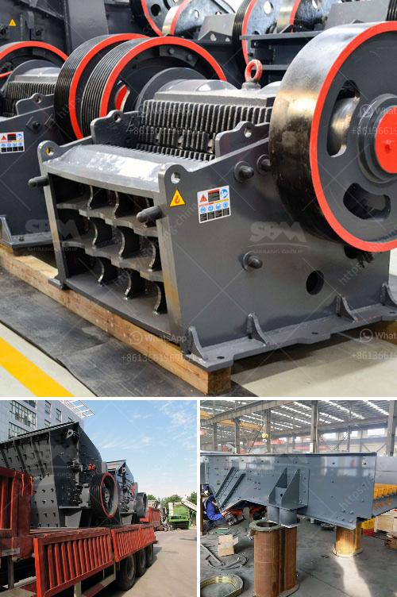

<h3>cost of a mill of hammers</h3>
In any industrial or construction setting, hammers are an indispensable tool. Whether it's for carpentry, masonry, or general repairs, hammers are essential for getting the job done efficiently. However, for large-scale operations or manufacturing facilities, the need for a sustainable supply of hammers necessitates the consideration of purchasing a mill of hammers. In this article, we will explore the cost implications associated with acquiring a mill of hammers and the factors to consider when making this investment.

A mill of hammers, also known as a hammer mill, refers to a facility or machine that is specifically designed for grinding, crushing, or pulverizing materials, including hammers used in various industries. These mills are commonly used in manufacturing plants, construction companies, or recycling centers that handle a large volume of hammer-related work.

1. Production Capacity: One key determinant of cost is the mill's production capacity. Higher capacity mills can process larger quantities of hammers in a given timeframe, increasing overall efficiency. However, the higher the production capacity, the larger the mill's footprint and typically, the higher the price tag.

2. Features and Customization: Advanced features such as automation, increased safety measures, energy efficiency, and ease of maintenance can significantly impact the cost of the mill. Additionally, customization options to suit specific industry needs or materials can also drive up the price.

3. Quality and Durability: Investing in a mill of hammers built with durable and high-quality components is crucial to ensure longevity and minimize maintenance and replacement costs. While higher quality mills might come with a higher initial price, they often offer a better return on investment due to reduced downtime and fewer repairs.

4. Scalability: Some mills of hammers offer the possibility of scaling up production over time. While initially purchasing a smaller mill appears more affordable, a scalable option can save costs in the long run by allowing expansion without needing to replace the entire system.

On average, the cost of a mill of hammers can range from $10,000 to $50,000, depending on the aforementioned factors. For a mid-range mill with a production capacity of 100,000 to 200,000 hammers per year, the price typically falls within the $20,000 to $30,000 range. However, it is important to note that these figures are estimates, and prices can vary depending on geographic location, supplier, and market conditions.

While the upfront cost of a mill of hammers may seem substantial, it's crucial to assess the potential return on investment (ROI). Determining the long-term cost savings based on increased production capacity, decreased labor costs, and reduced downtime due to maintenance can help justify the initial expense. Additionally, the ability to recycle or reuse materials, such as scrap hammers, within the mill can further enhance the ROI over time.

Acquiring a mill of hammers can be a significant investment for any industry that heavily relies on hammers. Understanding the cost implications and evaluating factors such as production capacity, features, quality, and scalability are key to making an informed decision. By considering the long-term benefits and potential return on investment, industries can ensure optimal efficiency and cost-effectiveness in their hammer-related operations.
<h3>Contact us</h3><ul><li><strong>Whatsapp:&nbsp;<a href="https://wa.me/8613661969651">+8613661969651</a></strong></li><li><a href="https://swt.shibang-china.com/?git&amp;zhl&amp;cost of a mill of hammers"><strong>Online Service(chat now)</strong></a></li></ul><h3>Related</h3><ul><li><a href='prices of crusher mandrel.md'>prices of crusher mandrel</a></li><li><a href='process of making quartz marble crusher.md'>process of making quartz marble crusher</a></li><li><a href='aggregate washing machine saudi arabia.md'>aggregate washing machine saudi arabia</a></li><li><a href='kaolin crusher processing machine.md'>kaolin crusher processing machine</a></li><li><a href='grinding size of bentonite crusher.md'>grinding size of bentonite crusher</a></li></ul>