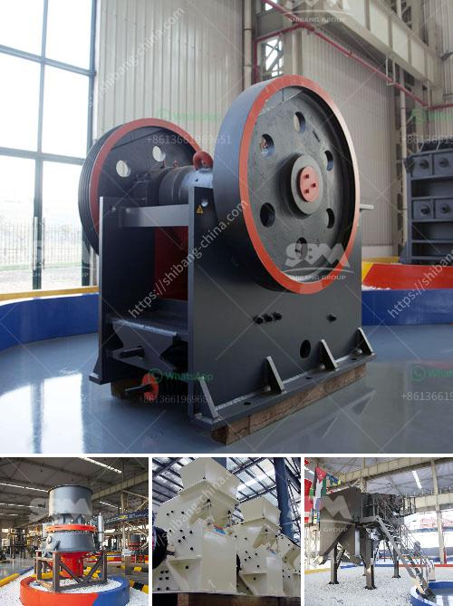

<h3>cost of cement plant</h3>
The cost of a cement plant can vary greatly depending on the size, location, and specific project requirements. The cost estimates provided below are general and are based on average market prices for a new cement plant. However, costs can fluctuate due to factors such as inflation, fluctuations in currency exchange rates, and specific project complexities. It is essential to conduct a detailed feasibility study and obtain commercial quotes from equipment manufacturers and construction companies to get precise cost estimates tailored to a specific project.

One of the main costs in setting up a cement plant is the machinery and equipment required to start operations. This includes a range of equipment such as crushers, conveyors, stackers, reclaimers, kilns, and cement mills. The cost of such machinery can range from a few million dollars to tens of millions of dollars, depending on the production capacity and technology level.

Another major cost component is the construction and installation of the plant infrastructure, including foundations, buildings, and utilities. The cost of civil works and construction can vary significantly depending on the location and local labor rates. Moreover, if the plant is to be built in a remote or challenging terrain, additional costs may be incurred for transportation and logistics.

In addition to machinery and infrastructure, other costs associated with setting up a cement plant include environmental permits and licenses, land acquisition, project management, and administrative expenses. There may also be costs related to obtaining specialized consultants or engineers to design and oversee the construction of the plant.

One aspect that greatly impacts the cost of a cement plant is its production capacity. Larger plants generally benefit from economies of scale, resulting in lower production costs per ton of cement produced. However, building larger plants also requires a larger initial investment. Therefore, it is crucial to strike a balance between the desired production capacity and the available financial resources.

An approximate estimation for a cement plant with a production capacity of 1 million tons per year would fall within a range of $100 million to $150 million. However, it is important to note that these are general estimates, and actual costs can vary significantly depending on numerous factors.

It is worth mentioning that the cost of a cement plant is more than just the initial investment. There are also operational costs that need to be considered, including raw material procurement, employee wages, energy consumption, and maintenance expenses. A comprehensive financial analysis needs to be conducted to evaluate the viability of a cement plant based on its anticipated revenue and profitability in the long run.

In conclusion, the cost of a cement plant can vary widely depending on various factors such as size, location, and specific project requirements. Careful planning, feasibility studies, and obtaining accurate commercial quotes are essential to determine the precise cost estimates for a cement plant project. It is also crucial to consider the operational costs to ensure the long-term economic sustainability of the plant.
<h3>Contact us</h3><ul><li><strong>Whatsapp:&nbsp;<a href="https://wa.me/8613661969651">+8613661969651</a></strong></li><li><a href="https://swt.shibang-china.com/?git&amp;zhl&amp;cost of cement plant"><strong>Online Service(chat now)</strong></a></li></ul><h3>Related</h3><ul><li><a href='industrial mills in mexico.md'>industrial mills in mexico</a></li><li><a href='cone crushers manufacturers.md'>cone crushers manufacturers</a></li><li><a href='limestone powder manufacture machine.md'>limestone powder manufacture machine</a></li><li><a href='gypsum crushing machine.md'>gypsum crushing machine</a></li><li><a href='sells hammer mills in zimbabwe.md'>sells hammer mills in zimbabwe</a></li></ul>