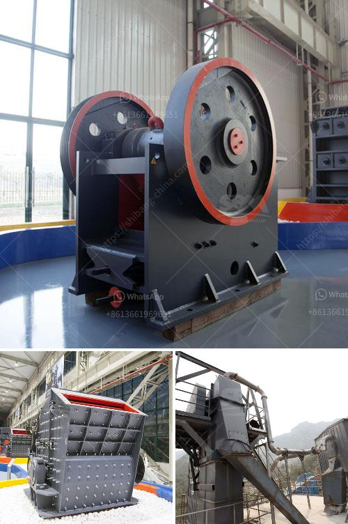

<h3>cost of crusher plant</h3>
The economic and social costs of a crusher plant heavily rely on various factors including the initial costs of purchasing the machinery, the maintenance and upkeep costs, the labor costs, as well as the transportation and production costs. A crusher plant plays a vital role in the construction industry, providing necessary aggregates to be used for the production of concrete and asphalt. Therefore, it is essential to analyze the overall cost of establishing and operating a crusher plant in order to determine its feasibility and profitability.

One of the primary considerations when setting up a crusher plant is the cost of purchasing the necessary equipment, which includes excavators, loaders, dump trucks, crushers, and screens. The price of these machines can range from thousands to millions of dollars, depending on their size, capacity, and functionality. It is crucial to select the appropriate machinery that fits the specific requirements of the project to avoid unnecessary expenses.

In addition to the initial investment, maintenance and upkeep costs should also be taken into account. Regular maintenance ensures the peak performance of the machinery and minimizes the chances of unexpected breakdowns or malfunctions. This includes routine inspections, lubrication, and replacement of worn-out parts, which can result in additional expenses. Additionally, if specialized technicians are needed to handle maintenance and repairs, their labor costs should also be factored into the overall budget.

Another aspect of cost estimation is the labor required to operate the crusher plant efficiently. Skilled and experienced personnel are essential to ensure the smooth running of the plant and to maximize its productivity. The cost of hiring and training employees, as well as providing salary and benefits, should be considered when calculating the operational costs of a crusher plant. It is important to strike a balance between hiring skilled workers and keeping labor costs within a sustainable range.

Transportation costs are another factor to consider as they can significantly impact the overall expenses of a crusher plant. The location of the plant, accessibility of raw materials, and the proximity to potential customers should all be taken into account. If the plant is situated far from the source of aggregates or the target market, transportation costs may rise, potentially affecting the profitability of the operation.

Additionally, production costs, including the cost of raw materials, energy consumption, and waste disposal, should be carefully evaluated. The cost of procuring quality aggregates to be crushed, as well as the cost of electricity and fuel required to operate the machinery, can affect the overall financial viability of the plant. Moreover, waste generated during the production process should be properly managed to comply with environmental regulations, which may incur additional costs.

In conclusion, establishing and operating a crusher plant requires a thorough cost analysis to determine its financial feasibility. The initial investment in machinery, maintenance and labor costs, transportation expenses, and production-related expenditures all contribute to the overall cost. It is vital to carefully consider and manage these costs to ensure the profitability and success of the crusher plant, as it directly impacts the construction industry's access to essential aggregates.
<h3>Contact us</h3><ul><li><strong>Whatsapp:&nbsp;<a href="https://wa.me/8613661969651">+8613661969651</a></strong></li><li><a href="https://swt.shibang-china.com/?git&amp;zhl&amp;cost of crusher plant"><strong>Online Service(chat now)</strong></a></li></ul><h3>Related</h3><ul><li><a href='jaw crusher crusher china.md'>jaw crusher crusher china</a></li><li><a href='cost of hammer mills for price.md'>cost of hammer mills for price</a></li><li><a href='dry ball mill in lima peru.md'>dry ball mill in lima peru</a></li><li><a href='white cement manufacturing process pdf.md'>white cement manufacturing process pdf</a></li><li><a href='stone crusher maker in india.md'>stone crusher maker in india</a></li></ul>