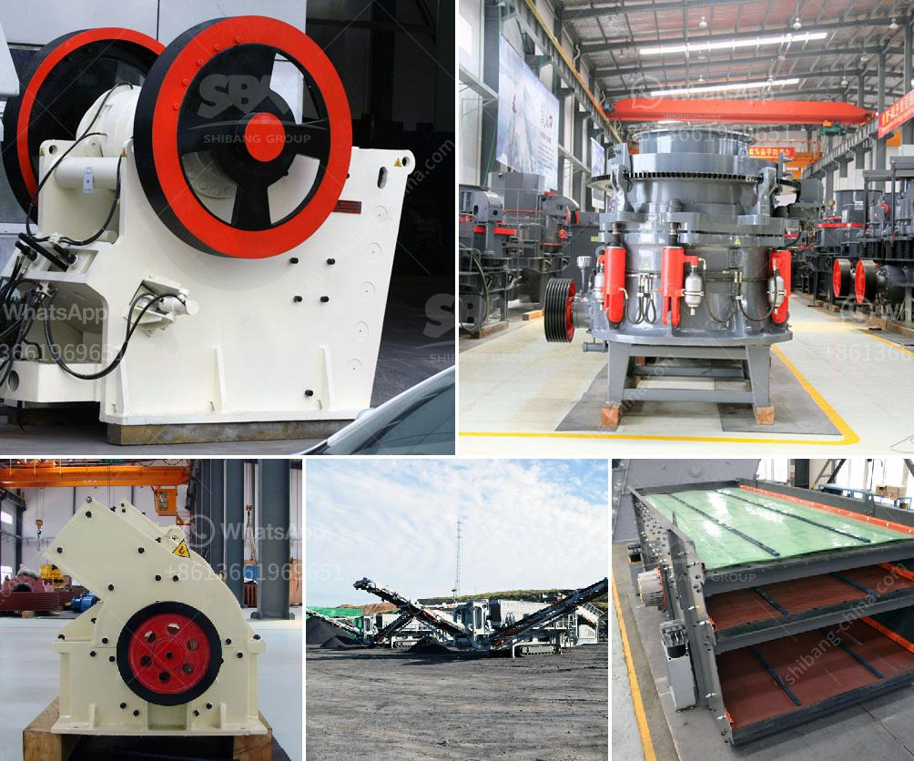

<h3>cost of establishing a quarry in nigeria</h3>
The cost of establishing a quarry in Nigeria can be daunting if you lack proper information on how to go about it. The quarry industry presents an opportunity for investors and entrepreneurs to leverage on demand for quarry products such as granite, aggregates, road base, and sand. However, this venture is fraught with challenges as a number of factors which will determine the success or failure of the quarry project. These factors include: the availability of deposit, the mobility of the stone to be crushed and its marketability.

The profitability of granite quarrying in Nigeria cannot be overemphasized. This is because it is a capital-intensive business that requires heavy machinery, labor, and investments to start. Many aspiring quarry owners have discovered the high costs involved and have opted for other alternatives. Granites are a great asset and as such, should be not overlooked.

1. Establish a quarry site with good quality deposit: You need to evaluate the land where you intend to establish the quarry to ensure it contains the necessary deposits for quarrying.

2. Obtain a lease/license from the government: Your quarry business will need rights to extract minerals from the land you choose to operate in.

3. Purchase equipment: The next step would be to purchase equipment which would be used in carrying out operations in the quarry. This would include excavators, crushers, tipper trucks and other machinery required to run the business.

4. Hire and train staff: The quarry business requires a team of skilled employees to operate successfully. You would need to enlist the services of professionals such as geologists, surveyors, engineers, and managers to oversee the day-to-day operations within the quarry.

5. Market your product: The final step is marketing your quarry products. You need to create awareness among potential customers by setting up a strategic marketing plan to attract and retain customers.

In conclusion, establishing a quarry business in Nigeria can be a profitable venture if properly planned and executed. You need to consider the challenges that exist in the Nigerian market and develop a well-designed business plan. Additionally, you should also carry out thorough market research to determine all the costs involved. With the right investment and hard work, you can successfully set up a quarry in Nigeria to cater to the growing demand in the construction sector.
<h3>Contact us</h3><ul><li><strong>Whatsapp:&nbsp;<a href="https://wa.me/8613661969651">+8613661969651</a></strong></li><li><a href="https://swt.shibang-china.com/?git&amp;zhl&amp;cost of establishing a quarry in nigeria"><strong>Online Service(chat now)</strong></a></li></ul><h3>Related</h3><ul><li><a href='gold mining equipment plant for sales.md'>gold mining equipment plant for sales</a></li><li><a href='roller mill for sale kenya.md'>roller mill for sale kenya</a></li><li><a href='project cost to manufacture 200 tpd cement in in nepal.md'>project cost to manufacture 200 tpd cement in in nepal</a></li><li><a href='small concrete crusher rental nj.md'>small concrete crusher rental nj</a></li><li><a href='coal washing plant manufacturers india.md'>coal washing plant manufacturers india</a></li></ul>