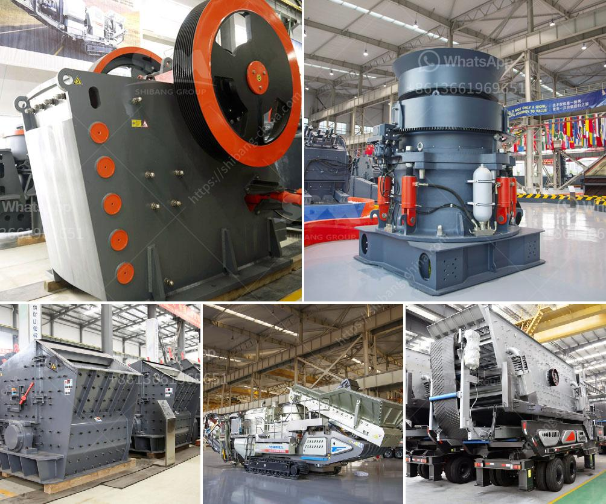

<h3>cost of grinding mill</h3>
The cost of grinding mill is definitely a significant factor that influences the choice of grinding mill. Grinding mill costs can be categorized into two broad groups: fixed costs and variable costs. As the name suggests, fixed costs are those that remain constant regardless of the production rate, while variable costs vary with the output.

Fixed costs include the initial investment in the grinding mill machinery, the costs of installation and commissioning, and the costs of maintenance and repairs. These costs are usually incurred once and do not change with the production rate. It is important to carefully evaluate the fixed costs to ensure that they are within budget and represent a good investment for the long term.

Variable costs, on the other hand, are directly proportional to the production rate. These costs include the energy consumption required to operate the grinding mill, the cost of grinding media (balls or rods), and the wear and tear of the grinding media and the mill internals. It is crucial to assess the variable costs because they directly affect the profitability and efficiency of the grinding process.

The cost of grinding mill can range from a few thousand dollars to several hundred thousand dollars depending on the size, capacity, and type of mill. With the rising demand for finely milled powders for industries such as mining, metallurgy, paints, pharmaceuticals, and chemicals, the need for more efficient grinding mills has become paramount.

Investing in a high-quality, cost-effective grinding mill is a wise decision. While the initial investment may seem significant, the long-term benefits in terms of increased production, reduced energy consumption, and minimized maintenance and repairs make it a cost-effective solution.

Furthermore, it is important to consider the reputation and expertise of the grinding mill manufacturer. A reliable and experienced manufacturer will not only provide a high-quality product, but also offer after-sales services such as technical support, spare parts availability, and assistance in optimizing the grinding process.

In conclusion, the cost of a grinding mill should be carefully evaluated to ensure a good return on investment. By considering both fixed and variable costs, as well as choosing a reputable manufacturer, one can make an informed decision that meets their needs and budget. Ultimately, a cost-effective grinding mill will contribute to higher efficiency, productivity, and profitability in various industries.
<h3>Contact us</h3><ul><li><strong>Whatsapp:&nbsp;<a href="https://wa.me/8613661969651">+8613661969651</a></strong></li><li><a href="https://swt.shibang-china.com/?git&amp;zhl&amp;cost of grinding mill"><strong>Online Service(chat now)</strong></a></li></ul><h3>Related</h3><ul><li><a href='mining equipment and hire zimbabwe.md'>mining equipment and hire zimbabwe</a></li><li><a href='sand dust removal.md'>sand dust removal</a></li><li><a href='mining calcium carbonate vietnam.md'>mining calcium carbonate vietnam</a></li><li><a href='vibrations roller mills.md'>vibrations roller mills</a></li><li><a href='ballast crusher plant.md'>ballast crusher plant</a></li></ul>