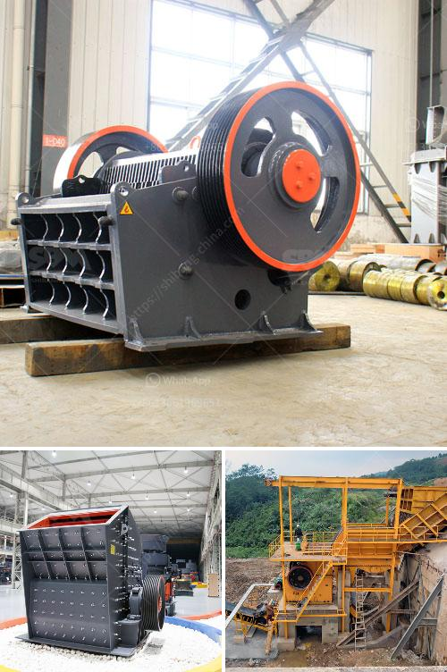

<h3>cost of hammer mills for price</h3>
Hammer mills are powerful grinding machines that crush, grind, or pulverize materials to produce a wide range of products. They are popular in many industries, including mining, agriculture, and construction, due to their versatility and efficiency. When it comes to the cost of purchasing a hammer mill, there are several factors to consider that can influence the final price.

One of the main considerations is the size and capacity of the hammer mill. Hammer mills come in various sizes, ranging from small portable units to large industrial models. The size of the mill will determine the volume of materials it can process at a time, which in turn affects its price. Smaller mills may cost less, but they also have lower processing capabilities, while larger models can handle a greater volume of material but may be more expensive.

Another factor that affects the price of a hammer mill is the type and quality of materials used in its construction. Hammer mills can be made from various materials, such as stainless steel, carbon steel, or cast iron. Each material has its own set of advantages and disadvantages in terms of durability, maintenance requirements, and cost. Stainless steel mills are generally more expensive due to their corrosion resistance and longer lifespan, while carbon steel and cast iron mills are more affordable options.

The brand and reputation of the manufacturer can also impact the price of a hammer mill. Well-known and reputable companies often charge higher prices for their products due to the trust and reliability associated with their brand. However, these higher prices can be justified by the quality, durability, and customer support provided by these manufacturers. It is crucial to research and choose a trusted manufacturer known for producing reliable and high-quality hammer mills.

The source of power required for the operation of the hammer mill is another factor that can affect its price. Hammer mills can be powered by electricity, diesel, or gasoline engines, or even tractor PTO. Electric-powered mills are usually more expensive upfront but can be more cost-effective in the long run due to lower operating costs. On the other hand, diesel or gasoline-powered mills may have a lower initial cost but require ongoing fuel expenses.

Finally, additional features and accessories can also add to the price of a hammer mill. Common optional features include dust collection systems, safety switches, and screens of different sizes for various grinding applications. These added features can enhance the performance and safety of the mill but might also increase its overall cost.

In conclusion, the cost of purchasing a hammer mill depends on various factors such as size, material, brand reputation, power source, and additional features. It is important to carefully consider these factors and assess the specific requirements of your operation before making a purchasing decision. While price is undoubtedly an important consideration, it is equally vital to prioritize quality, durability, and reliability to ensure optimal performance and long-term value for your investment.
<h3>Contact us</h3><ul><li><strong>Whatsapp:&nbsp;<a href="https://wa.me/8613661969651">+8613661969651</a></strong></li><li><a href="https://swt.shibang-china.com/?git&amp;zhl&amp;cost of hammer mills for price"><strong>Online Service(chat now)</strong></a></li></ul><h3>Related</h3><ul><li><a href='jaw crusher price saudi.md'>jaw crusher price saudi</a></li><li><a href='kaolin crusher production costs.md'>kaolin crusher production costs</a></li><li><a href='gold corporation ball mill.md'>gold corporation ball mill</a></li><li><a href='dolomite powder machine.md'>dolomite powder machine</a></li><li><a href='crusher machine price.md'>crusher machine price</a></li></ul>