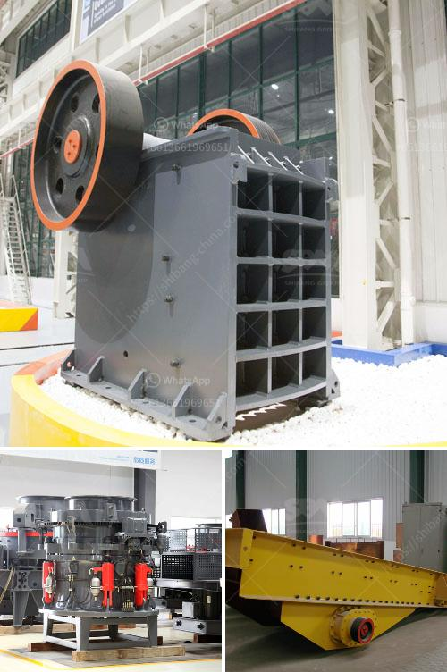

<h3>cost of jaw crusher</h3>
The cost of a jaw crusher is not fixed and it varies widely depending on the size and capacity of the machine, as well as the quality of components and materials used to manufacture it. The cost of a jaw crusher ranges between several thousand dollars to more than $10,000.

If you are in the market for a jaw crusher, you will want to make sure that you find the best price for the machine in the Philippines. The price is going to depend on many factors. One of the factors is going to be how large the machine is. Another important factor is which manufacturers you buy from. The last factor is that you have to ensure sufficient after-sales service and prompt spare parts supply. The vast majority of machines have cheap prices, but they don’t deliver the support you need when something goes wrong with the machine. This is one reason why you have to be careful about where you buy from.

To ensure that you get world-class after-sales service, look at the reputation of the company you are buying from. Read reviews from previous customers to see what they say about the company’s service. Doing a little bit of research can go a long way to preventing headaches down the road. The cost of jaw crusher also depends on the brand and the specific production requirements, so it can vary from supplier to supplier. If you want to buy the jaw crusher machine, the quality is a very important factor, otherwise you may have maintenance and economic losses. So please do remember to compare several specific jaw crusher models before making your final decision.

In conclusion, the cost of a jaw crusher depends on multiple factors, including the size and capacity of the machine, the quality of components and materials used in its manufacture, and the after-sales service provided by the manufacturer. It is important to do thorough research and compare different options to ensure you get the best value for your money when purchasing a jaw crusher.
<h3>Contact us</h3><ul><li><strong>Whatsapp:&nbsp;<a href="https://wa.me/8613661969651">+8613661969651</a></strong></li><li><a href="https://swt.shibang-china.com/?git&amp;zhl&amp;cost of jaw crusher"><strong>Online Service(chat now)</strong></a></li></ul><h3>Related</h3><ul><li><a href='conversion rules of stone crusher.md'>conversion rules of stone crusher</a></li><li><a href='old cement plant in india for sale.md'>old cement plant in india for sale</a></li><li><a href='stone crusher machine malaysia.md'>stone crusher machine malaysia</a></li><li><a href='crusher plant saudi.md'>crusher plant saudi</a></li><li><a href='jaw crusher plant for sale.md'>jaw crusher plant for sale</a></li></ul>