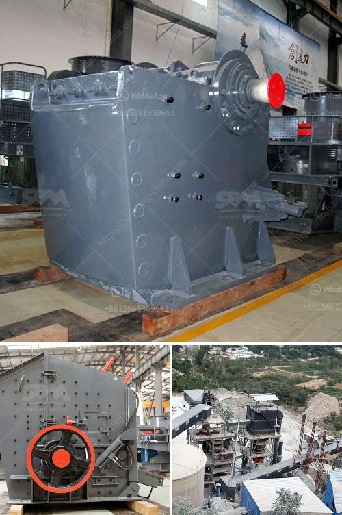

<h3>cost of small mica processing plant in giridih india</h3>
Mica mining and processing are essential industries in many parts of India, contributing to the country's economic growth and providing employment opportunities for local communities. In Giridih, a small town located in the state of Jharkhand, mica processing plants have gained prominence due to the town's abundance of high-quality mica deposits. However, establishing a small mica processing plant in Giridih involves various costs and considerations.

Firstly, acquiring the necessary land for the plant is a significant expense to consider. The cost of land in Giridih may vary depending on its proximity to mica deposits and local infrastructure. The ideal location for a mica processing plant would be in close proximity to the mines, as it minimizes transportation costs and ensures a constant supply of raw materials. Land prices in Giridih can range from INR 20 lakh to INR 50 lakh per acre, and the size of the plant will determine the amount of land required.

The construction of the processing plant itself is another major cost. The plant requires buildings or structures to house the machinery and equipment needed for mica processing. The construction cost will be influenced by factors such as the plant's size, complexity, and the materials used. Hiring skilled labor and professional contractors for the construction process is essential to ensure structural integrity and adherence to safety standards.

Additionally, the cost of procuring machinery and equipment for mica processing is a considerable expenditure. The equipment necessary for mica processing includes crushers, grinders, vibrating screens, and various other types of machinery. These machines are used to crush, grind, and sort mica into different grades and sizes for further processing or export. The cost of machinery can vary depending on the quality, brand, and capacity of the equipment required. On average, setting up the machinery and equipment for a small mica processing plant can cost between INR 50 lakhs to INR 1 crore.

Energy supply is another factor to consider. A mica processing plant requires a reliable source of electrical power to operate machinery effectively. The cost of setting up transformers, power lines, and electrical connections should be taken into account. Giridih, being a resource-rich region, generally has an adequate electrical supply. However, mica processing plants may need to invest in backup power sources or generators to ensure uninterrupted operations during power outages.

Labor costs are another aspect to consider. A mica processing plant requires skilled and semi-skilled workers to handle various tasks, such as operating machinery, sorting mica, and maintaining equipment. The availability of skilled labor in Giridih may affect the recruitment process. The cost of labor will depend on factors such as skill levels, prevailing wages, and working conditions. Estimates suggest that labor costs can range from INR 5,000 to INR 10,000 per month per worker.

In conclusion, establishing a small mica processing plant in Giridih, India, involves significant costs, including land acquisition, construction, machinery and equipment, energy supply, and labor. These expenses may vary depending on the size of the plant, local market conditions, and specific requirements. By carefully considering these costs and taking appropriate measures, entrepreneurs can capitalize on Giridih's rich mica deposits and contribute to the development of the local economy.
<h3>Contact us</h3><ul><li><strong>Whatsapp:&nbsp;<a href="https://wa.me/8613661969651">+8613661969651</a></strong></li><li><a href="https://swt.shibang-china.com/?git&amp;zhl&amp;cost of small mica processing plant in giridih india"><strong>Online Service(chat now)</strong></a></li></ul><h3>Related</h3><ul><li><a href='small cone crusher for sale za.md'>small cone crusher for sale za</a></li><li><a href='wet ball milling process.md'>wet ball milling process</a></li><li><a href='malaysia sand washer supplier.md'>malaysia sand washer supplier</a></li><li><a href='hammer mill manufacturer in tamilnadu.md'>hammer mill manufacturer in tamilnadu</a></li><li><a href='crushing plant in lahore.md'>crushing plant in lahore</a></li></ul>