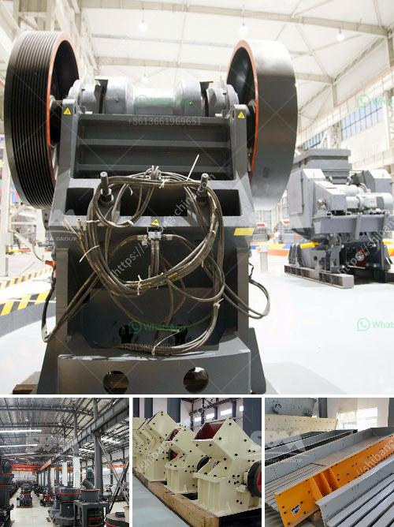

<h3>cost of small scale cement plant</h3>
The cement industry is one of the most important industries worldwide and plays a key role in the economic growth of a country. It is widely used in the construction of buildings, bridges, roads, and other infrastructure projects. As the demand for cement continues to rise, many entrepreneurs are considering investing in small-scale cement plants.

A small-scale cement plant produces a limited amount of cement per day, typically ranging from 500 to 2000 metric tons. These plants are simply constructed, require less initial investment, and are suitable for rural areas or areas with limited cement demand. However, determining the cost of setting up a small-scale cement plant can be a challenging task.

The cost of a small-scale cement plant varies depending on several factors. Firstly, the location of the plant greatly influences the overall cost. The cost of land and infrastructure can vary significantly from one location to another. It is crucial to choose a location that is close to the source of raw materials such as limestone, shale, or clay, as transporting these materials over long distances can be expensive.

Secondly, the size and capacity of the plant directly impact the cost. A small-scale cement plant with a capacity of less than 2000 metric tons per day may cost between $2 million and $5 million. The cost of a medium-scale cement plant, with a capacity of 2000-5000 metric tons per day, can range from $5 million to $15 million. Larger-scale cement plants, with a capacity exceeding 5000 metric tons per day, can have a cost of $20 million or more.

Another significant factor affecting the cost is the technology and equipment used in the cement manufacturing process. Technological advancements have led to the development of more efficient and cost-effective cement production methods. The cost of modern equipment such as crushers, mills, kilns, and packaging units can contribute substantially to the overall cost of setting up a small-scale plant.

Additionally, labor and operational costs should be considered. Labor costs can vary depending on the region and the availability of skilled workers. Operational costs, including electricity, water, fuel, and maintenance expenses, also add to the overall operating costs of the plant.

Moreover, compliance with environmental regulations and obtaining necessary permits and licenses may incur additional costs. Small-scale cement plants must meet strict environmental standards to minimize pollution and ensure sustainability. The expenses related to environmental compliance should be evaluated during the planning stage.

In conclusion, setting up a small-scale cement plant can be a lucrative investment opportunity. However, careful consideration of various factors is essential to estimate the cost accurately. Factors such as location, capacity, technology, labor, and regulatory compliance affect the cost of establishing a small-scale cement plant. Entrepreneurs interested in venturing into the cement industry should conduct thorough research and consult experts to gain an accurate estimate of the investment required.
<h3>Contact us</h3><ul><li><strong>Whatsapp:&nbsp;<a href="https://wa.me/8613661969651">+8613661969651</a></strong></li><li><a href="https://swt.shibang-china.com/?git&amp;zhl&amp;cost of small scale cement plant"><strong>Online Service(chat now)</strong></a></li></ul><h3>Related</h3><ul><li><a href='sand wash plants for sale in texas.md'>sand wash plants for sale in texas</a></li><li><a href='crushing machine in ghana.md'>crushing machine in ghana</a></li><li><a href='vibrating screen capacity calculation.md'>vibrating screen capacity calculation</a></li><li><a href='jaw crusher supplier in the philippines.md'>jaw crusher supplier in the philippines</a></li><li><a href='roller crusher equipment supplier.md'>roller crusher equipment supplier</a></li></ul>