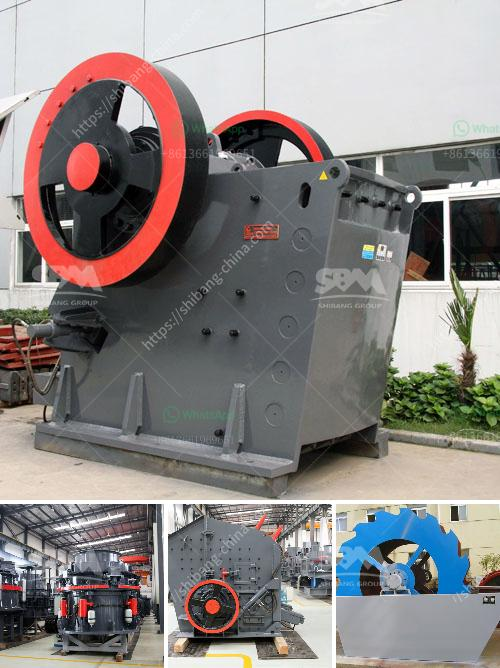

<h3>cost of stone crusher in kenya</h3>
The stone crusher machine in Kenya is widely used in the field of construction, mining, cement, chemical engineering and metallurgy. Its wide applications can meet the requirements of different customers. The machine has the advantages of high crushing efficiency, low investment in maintenance, low operating costs and so on.

The cost of stone crusher plant in Kenya includes the crusher machine cost and the infrastructure materials cost. Its compact size and excellent sealing performance make it suitable for crushing operations in restricted spaces. The machine is portable and can be used on a variety of materials, such as limestone, granite, and basalt.

The cost of stone crusher plant in Kenya is complex and depends on different factors. It includes the following aspects:

1. Land: The land needed for the crusher plant along with infrastructure includes buildings, gates, and fences. The cost of purchasing or leasing land varies depending on the location and size of the plot.

2. Raw materials: The cost of raw materials such as aggregates, cement, and sand is a significant factor in the overall cost of the project. The availability of these materials and transportation costs can impact the cost of stone crushers.

3. Labor: The labor required to operate and maintain the stone crusher plant also adds to the overall cost. Skilled workers may be needed for certain tasks, such as welding or equipment operation.

4. Machinery: The cost of purchasing or leasing crushers, screens, conveyors, and other equipment is another significant factor to consider. Different types of crushers have different prices, and the cost of spare parts and maintenance should also be taken into account.

In conclusion, the cost of stone crusher in Kenya can be affected by various factors. It is important to consider all these factors when planning and budgeting for a stone crusher plant. By choosing the right equipment and optimizing the operations, the cost can be minimized while still achieving a high level of productivity and efficiency.
<h3>Contact us</h3><ul><li><strong>Whatsapp:&nbsp;<a href="https://wa.me/8613661969651">+8613661969651</a></strong></li><li><a href="https://swt.shibang-china.com/?git&amp;zhl&amp;cost of stone crusher in kenya"><strong>Online Service(chat now)</strong></a></li></ul><h3>Related</h3><ul><li><a href='rock crusher distributors in denver colorado.md'>rock crusher distributors in denver colorado</a></li><li><a href='mobile crusher in japan used crusher.md'>mobile crusher in japan used crusher</a></li><li><a href='crusher manufacturer in.md'>crusher manufacturer in</a></li><li><a href='crushing and screening companies in south africa.md'>crushing and screening companies in south africa</a></li><li><a href='diagram of hammer mill.md'>diagram of hammer mill</a></li></ul>