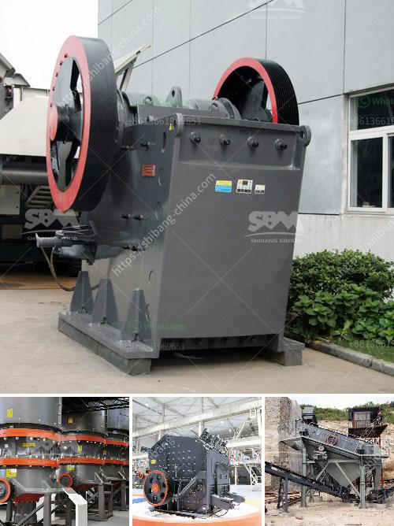

<h3>cost quarry machines</h3>
Quarrying is a complex and demanding industry that involves the extraction of valuable minerals or other geological materials from the earth's surface. To carry out this process efficiently and economically, quarry machines are crucial. These machines enable mining companies to increase productivity, reduce costs, and maximize profits. However, understanding the cost of quarry machines is essential before making any substantial investments.

The cost of quarry machines can vary significantly depending on various factors, including the type and size of the equipment, its specifications, and its usage requirements. Generally, there are two main types of quarry machines: stationary and mobile.

Stationary quarry machines are designed to remain fixed in one location throughout their lifespan. They require a substantial initial investment but may prove more cost-effective in the long run due to lower maintenance and operational costs. These machines can include crushers, conveyors, screens, and crushers. The cost of stationary quarry machines is often calculated based on their capacity, horsepower, and design.

On the other hand, mobile quarry machines offer greater flexibility and mobility. They can be easily moved from one location to another, which is particularly beneficial for shorter-term projects or when the mining operations require moving frequently. The cost of mobile quarry machines is usually determined based on their size, capacity, and mobility features.

In general, quarry machines can range in price from a few thousand dollars to several million dollars, depending on their specifications. For instance, a small-scale crusher can be purchased for around $10,000, while a larger crusher with advanced features may cost upwards of $1 million. Similarly, a conveyer belt system could vary in price from $5,000 to $50,000, depending on its length, capacity, and durability.

Apart from the initial cost of purchasing the quarry machines, there are other cost considerations that need to be taken into account. These include installation and setup costs, ongoing maintenance and repairs, fuel and energy costs, and the lifespan of the equipment. It's crucial to evaluate these factors carefully to determine the overall cost of owning and operating quarry machines.

In addition to the direct costs associated with quarry machines, mining companies must also consider the potential return on investment (ROI). A detailed cost-benefit analysis should be conducted to ensure that the investment in quarry machines will generate substantial profits in the long term. Factors such as the value of the extracted materials, market demand, and competition should be taken into account when estimating ROI.

Furthermore, it's important to explore financing options for quarry machines. Many companies, especially small enterprises, may find it challenging to finance the purchase of expensive equipment. Banks and financial institutions often provide loans or leasing options specifically designed for the mining industry. These financing options can help spread the cost of the machines over several years, making it more feasible for companies to acquire essential quarry equipment.

In conclusion, understanding the cost of quarry machines is crucial for mining companies to make informed investment decisions. It's essential to consider factors such as the size, type, and specifications of the equipment, as well as ongoing maintenance and ROI. By conducting a cost-benefit analysis and exploring financing options, mining companies can choose the most suitable quarry machines that will maximize productivity and profitability.
<h3>Contact us</h3><ul><li><strong>Whatsapp:&nbsp;<a href="https://wa.me/8613661969651">+8613661969651</a></strong></li><li><a href="https://swt.shibang-china.com/?git&amp;zhl&amp;cost quarry machines"><strong>Online Service(chat now)</strong></a></li></ul><h3>Related</h3><ul><li><a href='concrete crusher cost.md'>concrete crusher cost</a></li><li><a href='crusher equipment oman in muscat oman.md'>crusher equipment oman in muscat oman</a></li><li><a href='dolomite processing equipment.md'>dolomite processing equipment</a></li><li><a href='company mobile crushers.md'>company mobile crushers</a></li><li><a href='crusher plant saudi.md'>crusher plant saudi</a></li></ul>