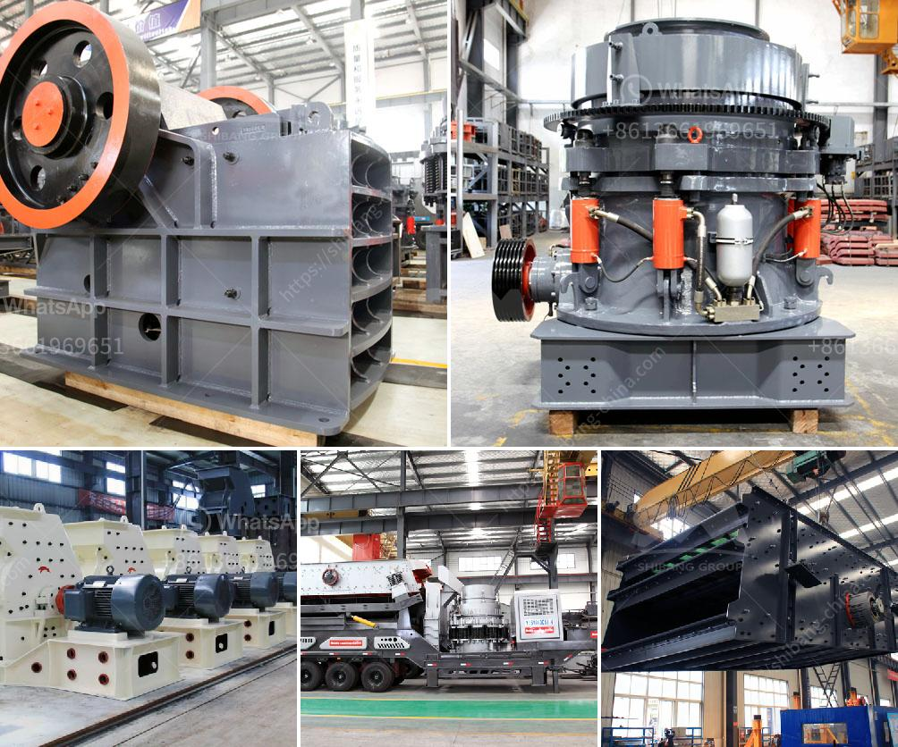

<h3>counties roller mills</h3>
In the heart of many small towns and rural areas, you'll often find a historic treasure that stands as a testament to the community's rich past and industrious spirit. One such gem is the Counties Roller Mills, an iconic landmark that has served as a hub for both the community and local industry for decades.

Located in the heart of counties, this towering mill stands as a silent witness to a bygone era when agriculture and milling were the lifeblood of the region. Built in the late 19th century, the Counties Roller Mills was a vital cog in the local economy, driving the growth and prosperity of the surrounding communities.

The advent of roller milling technology revolutionized the milling process, resulting in more efficient and refined flour production. This technological leap allowed the Counties Roller Mills to become a major player in the industry, attracting farmers from far and wide who sought to transform their wheat and grains into high-quality flour.

The mill's strategic location, nestled amidst lush farmland, made it an ideal destination for farmers to bring their crops for processing. The sight of wagons brimming with wheat waiting to be milled became a common spectacle, with the mill serving as a vibrant center of commerce and exchange.

However, the Counties Roller Mills was more than just a milling facility; it was also a vibrant meeting place for the local community. Adjacent to the mill, a bustling marketplace sprang up, where farmers and residents converged to buy and sell an array of goods. The mill's owners took pride in supporting local businesses, acting as a catalyst for economic growth in the area.

Over time, the mill evolved to meet the changing needs of the community and advancements in technology. It expanded its operations to include the production of animal feed, cement, and other processed grain products. The continued relevance of the Counties Roller Mills allowed it to weather economic downturns and remain a vital institution for generations to come.

As new milling techniques emerged and larger industrial facilities dominated the market, smaller mills like the Counties Roller Mills faced the threat of obsolescence. However, the community recognized the historical and cultural significance of their beloved mill and rallied together to preserve it.

Thanks to the efforts of local preservation societies and passionate individuals, the Counties Roller Mills has been lovingly restored and repurposed to serve the needs of the modern community. Now, it houses a museum that showcases the history of milling, providing visitors with an immersive experience of the region's agricultural heritage.

Today, the Counties Roller Mills stands as an enduring symbol of the community's resilience and the importance of preserving our industrial past. As visitors step inside this architectural marvel, they are transported back in time, where the rhythmic hum of machinery and the scent of freshly milled flour evoke a sense of nostalgia and appreciation for a bygone era.

In an age of rapid urbanization and technological advancements, it is important to recognize and honor the historical landmarks that shaped our communities. The Counties Roller Mills serves as a reminder of the rich tapestry of our collective history and the unwavering spirit of the people who built and sustained it.

As we celebrate these icons of our past, let us also strive to support and preserve the institutions that remain pillars of our community. By doing so, we ensure that future generations can marvel at the Counties Roller Mills and understand its enduring significance for years to come.
<h3>Contact us</h3><ul><li><strong>Whatsapp:&nbsp;<a href="https://wa.me/8613661969651">+8613661969651</a></strong></li><li><a href="https://swt.shibang-china.com/?git&amp;zhl&amp;counties roller mills"><strong>Online Service(chat now)</strong></a></li></ul><h3>Related</h3><ul><li><a href='vrm cement plant.md'>vrm cement plant</a></li><li><a href='grinding in vertical roller mill.md'>grinding in vertical roller mill</a></li><li><a href='prices for cheap roller mills in south africa.md'>prices for cheap roller mills in south africa</a></li><li><a href='calculate grinding ball diameter for ball mill.md'>calculate grinding ball diameter for ball mill</a></li><li><a href='mobile cone crusher for sale.md'>mobile cone crusher for sale</a></li></ul>