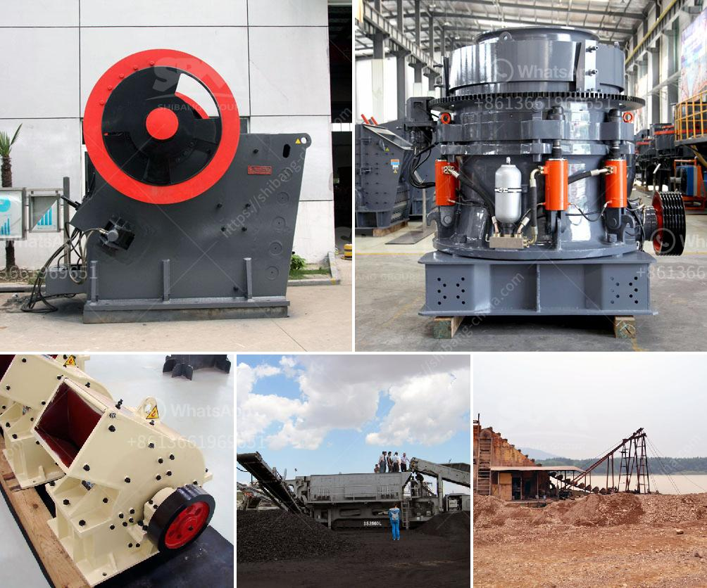

<h3>crush machine price in pakistan</h3>
With the rapid urbanization and industrialization in Pakistan, the demand for crush machines is increasing gradually. As a result, there is a surge in the number of crushing equipment manufacturers and suppliers offering a wide range of crush machines in Pakistan.

To cater to the growing needs of construction and development projects in the country, crush machines have become an essential part of the construction industry. They are primarily used to break large rocks into smaller rocks, gravel, or dust for various purposes such as making concrete, filling roadways, and creating foundations.

The price of crush machines in Pakistan varies depending on the brand, model, and capacity. The prices range from Rs. 25,000 to Rs. 2,00,000 per unit, based on the capacity. The type and design of the crushing machines also influence the price. Some machines are more efficient and powerful than others, and hence, come with a higher price tag.

It is crucial to consider factors such as the quality, performance, and durability of the crush machine before making a purchasing decision. The price should not be the sole determining factor. Buyers should thoroughly research and compare different brands and models available in the market to find the right crush machine that meets their specific requirements and budget.

Moreover, it is advisable to buy from reputable suppliers or manufacturers to ensure the quality and reliability of the crush machine. Reputable suppliers often offer warranties and after-sales services, which can be beneficial in case of any issues or maintenance requirements.

In conclusion, the crush machine price in Pakistan varies depending on various factors such as brand, model, capacity, and design. It is essential to conduct thorough research, compare prices, and consider the quality and performance of the machine before making a purchase. Buyers should opt for reputable suppliers to ensure the reliability and durability of the crush machine. By making an informed decision, one can find a suitable crush machine that meets their construction needs within their budget.
<h3>Contact us</h3><ul><li><strong>Whatsapp:&nbsp;<a href="https://wa.me/8613661969651">+8613661969651</a></strong></li><li><a href="https://swt.shibang-china.com/?git&amp;zhl&amp;crush machine price in pakistan"><strong>Online Service(chat now)</strong></a></li></ul><h3>Related</h3><ul><li><a href='used hammer crusher.md'>used hammer crusher</a></li><li><a href='roller machines for milling.md'>roller machines for milling</a></li><li><a href='stone crusher machines from denmark.md'>stone crusher machines from denmark</a></li><li><a href='crusher equipment oman in muscat oman.md'>crusher equipment oman in muscat oman</a></li><li><a href='works cement grinding ball mill.md'>works cement grinding ball mill</a></li></ul>