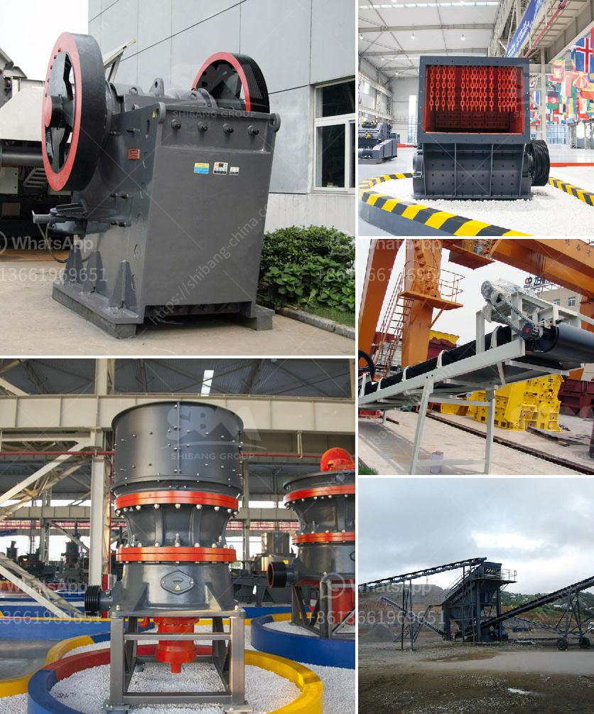

<h3>crusher business aggregate</h3>
The construction industry relies on different types of aggregate materials for various purposes. Firstly, the soil stabilizer, which is responsible for consolidating and stabilizing the base layer of roads, is made of aggregates mixed with cement. Secondly, the aggregates are used as the primary material in concrete for constructing buildings and infrastructures. Lastly, aggregates are also used as drainage material in foundation work, such as creating a strong and sturdy base for a building. Therefore, the crusher business plays a crucial role in the aggregate industry.

Aggregate materials are essential for construction projects of all sizes and types. From residential buildings and commercial properties to highways and bridges, the need for aggregates cannot be overlooked. The use of aggregates has been a cornerstone of construction for thousands of years, and it continues to be a fundamental component in modern-day construction.

The process of producing aggregates involves crushing the raw materials, such as stone, gravel, and sand, which are then screened and sorted to produce the required size. Different crushers are used depending on the type of material, the desired product size, and the desired capacity.

The primary crusher is responsible for reducing the size of the raw materials into small, manageable pieces. This stage is essential in preparing the materials for the secondary crusher, which further breaks down the aggregates into the desired size. The tertiary crusher then finely crushes the materials to achieve the desired product shape and consistency.

In the crusher business, selecting the right type and size of crusher plays a significant role in ensuring the success of the crushing process. The proper selection will result in improved productivity, reduced downtime, and increased profitability. Various factors, such as the type of material, hardness, moisture content, and desired product size, need to be considered when choosing the right crusher.

Additionally, maintaining and servicing the crushers regularly is crucial to ensure their optimal performance and longevity. Regular inspection and cleaning of the crusher components, such as the jaw plates, liners, and bearings, can prevent unexpected breakdowns and costly repairs. Following the manufacturer's recommended maintenance schedule and using high-quality replacement parts are vital in maintaining the crushers' efficiency and extending their lifespan.

Furthermore, environmental concerns have become an important aspect of the crusher business. The efficient use of energy, recycling of materials, and proper waste management are essential elements in the sustainable operation of aggregate crushers. Measures such as using energy-efficient motors, implementing dust suppression systems, and recycling waste materials can minimize the environmental impact of the crusher business.

In conclusion, the crusher business is crucial in the aggregate industry. Aggregate materials are essential for various construction projects, and the crushing process is the key to producing them correctly. Selecting the right crusher, maintaining it properly, and considering environmental factors are vital for the success of the crusher business. By prioritizing these aspects, the crusher business can contribute to the sustainable development of the construction industry.
<h3>Contact us</h3><ul><li><strong>Whatsapp:&nbsp;<a href="https://wa.me/8613661969651">+8613661969651</a></strong></li><li><a href="https://swt.shibang-china.com/?git&amp;zhl&amp;crusher business aggregate"><strong>Online Service(chat now)</strong></a></li></ul><h3>Related</h3><ul><li><a href='jual crusher batubara di indonesia.md'>jual crusher batubara di indonesia</a></li><li><a href='sand wash plants for sale in texas.md'>sand wash plants for sale in texas</a></li><li><a href='hydraulic system vertical roller mill.md'>hydraulic system vertical roller mill</a></li><li><a href='pe jaw crusher.md'>pe jaw crusher</a></li><li><a href='cement industries ball coal mill.md'>cement industries ball coal mill</a></li></ul>