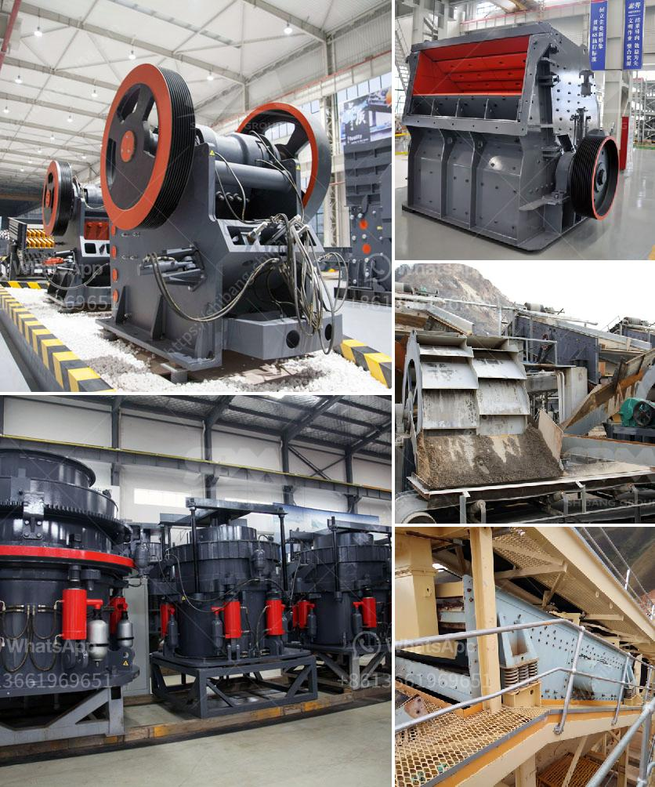

<h3>crusher conveyor belt</h3>
The crusher conveyor belt is one of the most important parts in mining operations. It carries the ore to the crusher, breaks it down into smaller pieces, and transports it to the next phase of processing. However, an inefficient conveyor belt system can lead to significant downtime and lower productivity.

One of the key factors that determine the efficiency of a crusher conveyor belt is its design. The conveyor belts are typically made of rubber or steel and consist of several layers. The top layer is known as the cover, which protects the inner layers from wear and tear. The middle layer provides strength and support, while the bottom layer prevents the belt from slipping.

The design of the crusher conveyor belt also plays a crucial role in its performance. For instance, a belt with cleats or ribs can enhance the grip on the material and prevent it from sliding back. This is particularly important when conveying heavy or bulky materials. Moreover, belts with a wider width can transport larger quantities of ore, improving overall efficiency.

Along with the design, regular maintenance of the crusher conveyor belt is essential for its optimal operation. This includes cleaning the belt to remove any debris or material buildup, checking for any signs of wear or tear, and lubricating the bearings to reduce friction. Proper tensioning of the belt is also necessary to prevent slippage and ensure smooth operation.

In recent years, technological advancements have further enhanced the performance of crusher conveyor belts. For instance, the use of sensors can automatically detect any issues with the belt, such as misalignment or excessive tension. This allows for quick detection and resolution of potential problems before they cause major disruptions.

To conclude, the crusher conveyor belt is a vital part of mining operations. Its design, maintenance, and technological advancements determine its efficiency and overall performance. Therefore, it is crucial to invest in high-quality belts, regular maintenance, and utilize advanced monitoring technologies to ensure smooth and uninterrupted operation, ultimately maximizing productivity.
<h3>Contact us</h3><ul><li><strong>Whatsapp:&nbsp;<a href="https://wa.me/8613661969651">+8613661969651</a></strong></li><li><a href="https://swt.shibang-china.com/?git&amp;zhl&amp;crusher conveyor belt"><strong>Online Service(chat now)</strong></a></li></ul><h3>Related</h3><ul><li><a href='second hand vrm cement mill for sale.md'>second hand vrm cement mill for sale</a></li><li><a href='jaw crusher malaysia.md'>jaw crusher malaysia</a></li><li><a href='coal mill pulverizer in thermal power plant.md'>coal mill pulverizer in thermal power plant</a></li><li><a href='coal pulverizing mills.md'>coal pulverizing mills</a></li><li><a href='the product of the stone crusher.md'>the product of the stone crusher</a></li></ul>