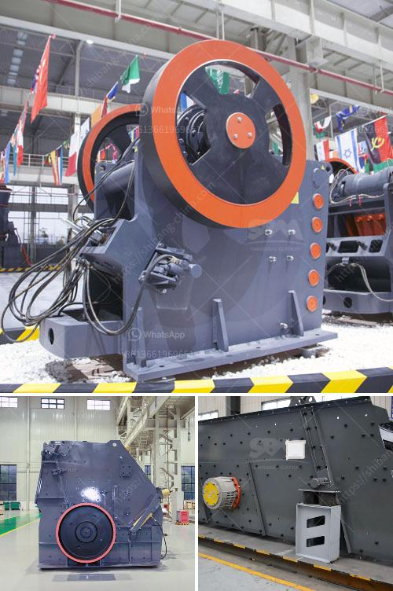

<h3>crusher equipment oman in muscat oman</h3>
The significance of finding the right crushing and screening equipment cannot be overstated when it comes to optimizing your quarry operation in Oman. This is especially true for the production of aggregates used in various construction projects throughout the region. In Muscat, the capital city of Oman, crusher equipment plays a pivotal role in efficiently breaking down blasted rocks, ensuring that the resulting aggregates are of the desired size and quality.

Oman's strategic location on the Arabian Peninsula has made it a key player in the construction industry, with extensive infrastructure projects driving the demand for high-quality aggregates. Crusher equipment in Muscat, Oman, therefore, becomes crucial in meeting the strict specifications laid out by construction companies for their projects.

The primary goal of crusher equipment is to reduce the size of rocks or stones, making it easier to transport and ensuring that materials are processed efficiently. One commonly used machine in Muscat quarries is the jaw crusher, which features a stationary plate and a moving plate that work together to crush large rocks into smaller ones. Another essential equipment is the cone crusher, which further breaks down the crushed material into finer particles.

In addition to crushers, screening equipment is also a vital component of the crushing process. Screens are used to separate different-sized aggregates based on their particle size, ensuring that only materials within the desired range are forwarded to further processing.

There are various types of crusher equipment available in Muscat, from well-known manufacturers that offer different features and capabilities. These include mobile crushers, which are highly versatile and can be transported easily from one site to another, ensuring efficient operation in different locations.

It is important for quarry operators in Muscat, Oman, to invest in reliable and durable crusher equipment. Regular maintenance and timely upgrades are crucial to ensuring the longevity and efficiency of these machines. By adhering to proper maintenance practices, quarry operators can avoid costly breakdowns and maintain continuous production and supply of aggregates to the construction industry.

In conclusion, crusher equipment plays a vital role in Muscat, Oman's quarry operations. The ability to efficiently crush and screen rocks ensures the production of high-quality aggregates, meeting the strict specifications required for the region's extensive construction projects. Proper maintenance and occasional upgrades are essential to optimize the crushing process and extend the lifespan of these machines. By investing in reliable crusher equipment, quarry operators can ensure steady production and contribute to the growth and development of Oman's construction industry.
<h3>Contact us</h3><ul><li><strong>Whatsapp:&nbsp;<a href="https://wa.me/8613661969651">+8613661969651</a></strong></li><li><a href="https://swt.shibang-china.com/?git&amp;zhl&amp;crusher equipment oman in muscat oman"><strong>Online Service(chat now)</strong></a></li></ul><h3>Related</h3><ul><li><a href='limestone crusher hammers.md'>limestone crusher hammers</a></li><li><a href='limestone crushing equipment.md'>limestone crushing equipment</a></li><li><a href='mobile crusher in uae for sale.md'>mobile crusher in uae for sale</a></li><li><a href='300tph ball mill manufacturer in philippines.md'>300tph ball mill manufacturer in philippines</a></li><li><a href='pine cone coal manufacturing machinery.md'>pine cone coal manufacturing machinery</a></li></ul>