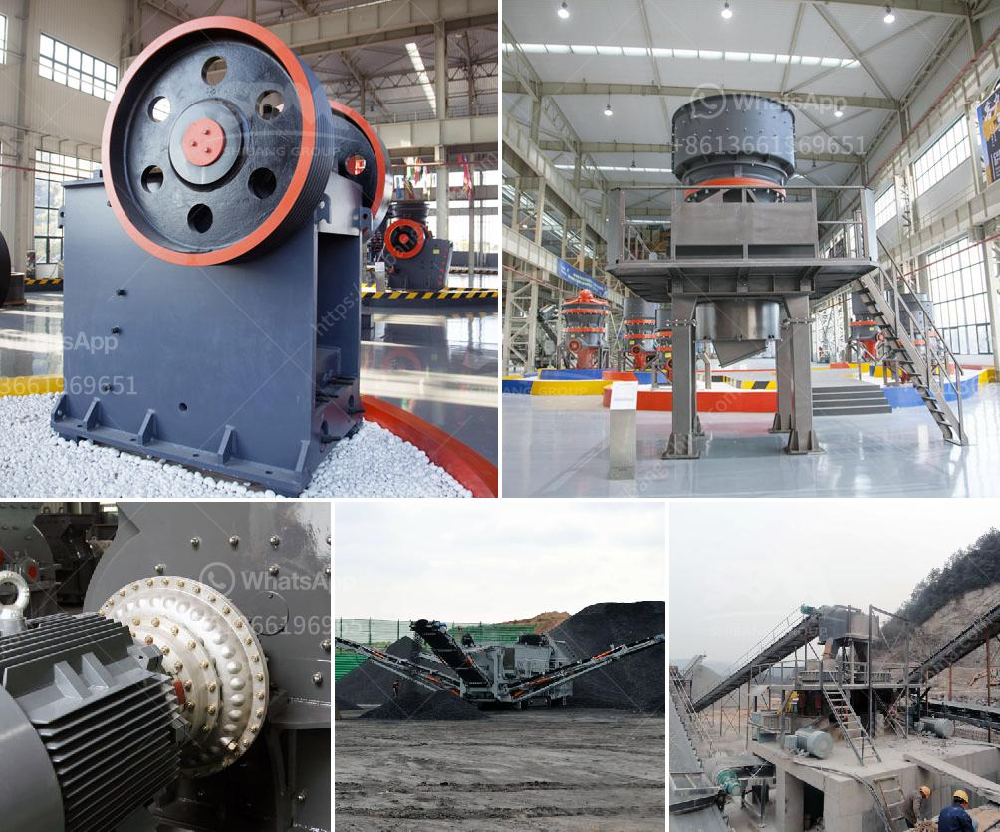

<h3>crusher equipment price</h3>
Crushing equipment plays a crucial role in various industries, including mining, construction, and recycling. Investing in a reliable crusher machine is essential for efficient and effective operations. However, one important consideration that can significantly impact the decision-making process is the price of the crusher equipment.

The price of crusher equipment can vary considerably based on several factors. Let's take a closer look at some of these factors to understand why prices may vary and what potential buyers should consider when making a purchase.

1. Type of Crusher: There are different types of crushers available in the market, such as jaw crushers, cone crushers, impact crushers, and gyratory crushers. Each type has its own unique features and capabilities, which can affect the pricing.

2. Size and Capacity: Crushers come in different sizes and capacities, ranging from small units suitable for domestic use to large machines designed for heavy-duty industrial applications. The size and capacity of the equipment influence its price, with larger and more powerful crushers generally commanding higher prices.

3. Brand and Reputation: Well-established and reputable brands often come with a higher price tag due to their reliability and the trust they have built among customers. The quality, durability, and after-sales service provided by reputed brands can justify the higher cost.

4. Technology and Features: Advanced crusher machines equipped with the latest technology and additional features might result in a higher price. These features can enhance the efficiency, productivity, and safety of the equipment, making it a more attractive investment in the long run.

5. Demand and Market Conditions: Like any other commodity, crusher equipment prices can be influenced by supply and demand dynamics. Market conditions, including the availability of raw materials, economic stability, and industry trends, can impact the pricing decisions of manufacturers.

When considering crusher equipment prices, buyers should carefully evaluate their specific requirements and budgetary constraints. It is advisable to research and compare multiple options, considering factors such as quality, performance, and after-sales support, in addition to price. It is essential to strike a balance between the price and the overall value that the equipment can provide to ensure a successful investment.

In conclusion, the price of crusher equipment is influenced by various factors like the type of crusher, size and capacity, brand reputation, technology and features, and market conditions. Understanding these factors and carefully assessing one's needs can help potential buyers make informed decisions and choose a crusher machine that best suits their requirements while offering good value for money.
<h3>Contact us</h3><ul><li><strong>Whatsapp:&nbsp;<a href="https://wa.me/8613661969651">+8613661969651</a></strong></li><li><a href="https://swt.shibang-china.com/?git&amp;zhl&amp;crusher equipment price"><strong>Online Service(chat now)</strong></a></li></ul><h3>Related</h3><ul><li><a href='small scale gold milling and processing plant.md'>small scale gold milling and processing plant</a></li><li><a href='mobile crusher hire in uae.md'>mobile crusher hire in uae</a></li><li><a href='rock sand machinery india.md'>rock sand machinery india</a></li><li><a href='portable stone crusher machine usa.md'>portable stone crusher machine usa</a></li><li><a href='pioneer ve rock crusher.md'>pioneer ve rock crusher</a></li></ul>