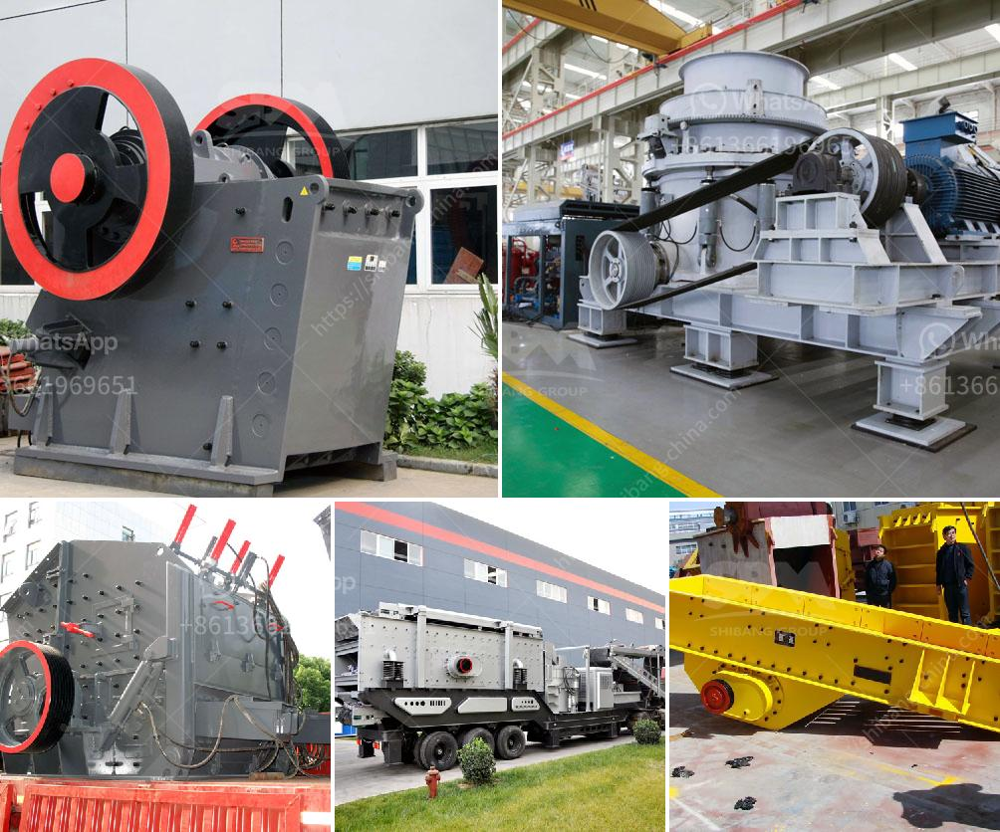

<h3>crusher for ballast concrete</h3>
Crusher machines are essential equipment for any construction project, especially for infrastructure projects, as ballast concrete is essential for the foundation of roads and railways. As an inevitable result of urban development, the construction industry has been on the rise in recent years, leading to an increase in the demand for crusher machinery.

The primary purpose of a crusher machine is to crush materials into smaller pieces in order to make them suitable for recycling or disposal. The process of crushing material using a crusher machine is useful in reducing the size of the materials and enables easy disposal or recycling.

Crushing is an important process in turning rock into a useable product. Rock enters the jaw crusher from the top of the machine and gets compressed between two surfaces — the fixed and moveable jaw. The rock will continue to be crushed until it is small enough to fall through the opening. Ensuring that the size of raw material is appropriately matched to the crusher opening can alleviate blockage incidents.

Crusher machines help improve efficiency in ensuring quality product, and adds value to the materials being processed. They are designed specifically to reduce the size of large rocks into smaller rocks such as gravel, limestone, or ballast concrete.

Ballast concrete is an essential part of the foundation for many construction projects. The process of crushing ballast concrete requires a crusher machine that provides a powerful crushing action. This process is extremely time-consuming and requires a good deal of power.

Crusher machines efficiently reduce the size of materials, ensuring minimal wastage. With an efficient machine, a significant amount of ballast concrete can be recycled, resulting in the reuse of natural resources and reducing construction waste in landfills.

When choosing a crusher machine, it is important to consider the type of material to be crushed, the desired product size, and the capacity. Crushers can be classified into primary, secondary, and tertiary crushers depending on their size reduction capabilities. Primary crushers are designed to crush large rocks into smaller rocks for further processing. Secondary crushers are typically used after primary crushers to further reduce the size of the material. Tertiary crushers are used to produce the final product size.

In conclusion, crusher machines are essential equipment for any construction project. They enable the efficient crushing of materials to create ballast concrete, which is an important component in the construction of roads, railways, and other infrastructure projects. With the growing demand for construction, crusher machines play a crucial role in ensuring the sustainability of this industry by recycling and reusing materials, reducing wastage, and minimizing the need for new raw materials. Choosing the right crusher machine based on the desired product size and capacity will optimize efficiency and maximize productivity in construction projects.
<h3>Contact us</h3><ul><li><strong>Whatsapp:&nbsp;<a href="https://wa.me/8613661969651">+8613661969651</a></strong></li><li><a href="https://swt.shibang-china.com/?git&amp;zhl&amp;crusher for ballast concrete"><strong>Online Service(chat now)</strong></a></li></ul><h3>Related</h3><ul><li><a href='types of diesel hammer mills in zimbabwe.md'>types of diesel hammer mills in zimbabwe</a></li><li><a href='quarry crusher plant machinery.md'>quarry crusher plant machinery</a></li><li><a href='german made jaw crusher prices.md'>german made jaw crusher prices</a></li><li><a href='conveyor belts in peru.md'>conveyor belts in peru</a></li><li><a href='copper ore crushing plant in chile.md'>copper ore crushing plant in chile</a></li></ul>