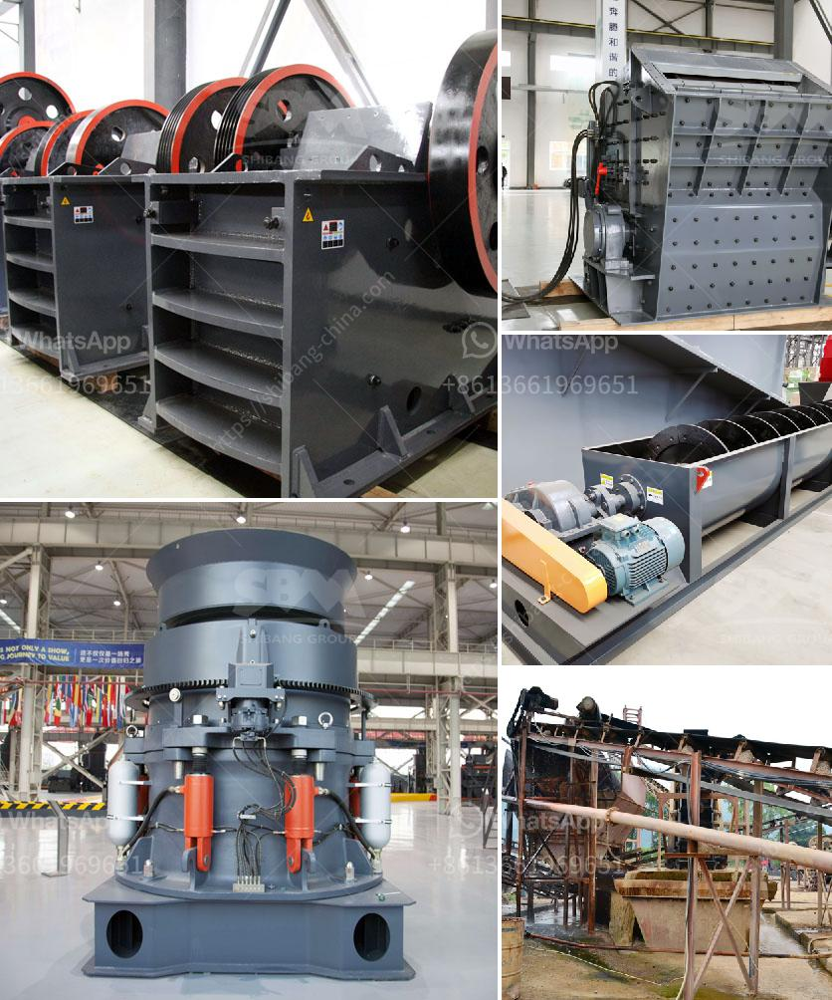

<h3>crusher for iron ore</h3>
Iron ore is one of the most important raw materials for iron and steel production enterprises. The iron content of ore is an important factor in its utilization. The crusher is an essential equipment in the iron ore mining industry, helping secure the efficient processing of mines.

Currently, there are various types of crushers on the market, including jaw crushers, impact crushers, cone crushers, and hammer crushers. These machines have their advantages and are suitable for different applications. However, when it comes to crushing iron ore, jaw crushers are undoubtedly the best choice.

Jaw crushers can handle large chunks of iron ore with ease and crush it into small pieces. The machine's durability and versatility mean that it is not just limited to crushing iron ore, but also a variety of other materials including minerals, aggregates, and even quarry rocks. The jaw crusher is designed to crush materials with a compressive strength up to 320 MPa, making it suitable for various industries and applications.

The jaw crusher has a simple design with a large feed opening and a narrow discharge opening. This design ensures a uniform product size, smooth operation, and high efficiency. Additionally, the crusher is equipped with a hydraulic system that adjusts the size of the discharge opening, allowing for precise control over the final product. This feature is especially useful when dealing with varying ore grades and maximizing the value of the produced iron ore.

When compared to other types of crushers, jaw crushers have a higher processing capacity and produce a more consistent particle size. This makes them an ideal choice for iron ore crushing, where the amount of ore processed per hour is crucial, and the consistency of the particle size directly impacts the quality and efficiency of the iron and steel production process.

Moreover, jaw crushers are known for their excellent reliability and low maintenance requirements. This is of great importance in the iron ore mining industry, where the equipment operates in challenging and harsh environments. The robust structure and heavy-duty components ensure the crusher can withstand heavy loads and deliver reliable performance throughout its lifespan.

In conclusion, the crusher for iron ore plays an important role in iron ore processing. With the continuous development of steel production, the demand for iron ore has also increased. The crushing efficiency of the equipment is directly related to the efficiency of the entire beneficiation process, boosting the overall productivity of the mine. Therefore, choosing the appropriate crusher for iron ore is crucial to ensure its maximum potential is unleashed. Jaw crushers have proven to be the best choice in this regard, combining durability, versatility, and efficiency to deliver high-quality iron ore products.
<h3>Contact us</h3><ul><li><strong>Whatsapp:&nbsp;<a href="https://wa.me/8613661969651">+8613661969651</a></strong></li><li><a href="https://swt.shibang-china.com/?git&amp;zhl&amp;crusher for iron ore"><strong>Online Service(chat now)</strong></a></li></ul><h3>Related</h3><ul><li><a href='grinding mill price in.md'>grinding mill price in</a></li><li><a href='slag crusher plant india.md'>slag crusher plant india</a></li><li><a href='turkey gold processing plants.md'>turkey gold processing plants</a></li><li><a href='jaw crushers in harare zimbabwe.md'>jaw crushers in harare zimbabwe</a></li><li><a href='vibratory feeder manufacturer china.md'>vibratory feeder manufacturer china</a></li></ul>