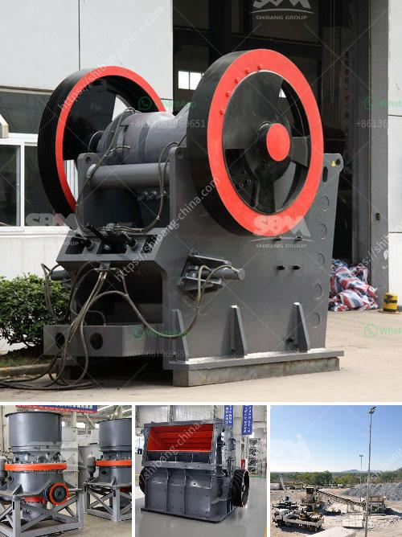

<h3>crusher for pozzuolana</h3>
Pozzolana, also known as volcanic ash, is a naturally occurring material that has been used in construction for centuries. In recent years, its popularity as a sustainable alternative to cement has grown, due to its ability to enhance the strength and durability of concrete.

One crucial aspect of using pozzolana in construction is the process of crushing it into a fine powder. This powder is then mixed with cement to create pozzolanic cement, which offers numerous benefits over traditional cement.

To efficiently crush pozzolana, a reliable and robust crusher is essential. A crusher for pozzolana is specifically designed to break down the raw material into smaller pieces for further processing. It plays a crucial role in the production of pozzolanic cement by reducing the particle size of the pozzolana and increasing its reactivity.

The primary crusher used for pozzolana crushing is the jaw crusher. It is well-suited for crushing large size materials into smaller, more manageable pieces. Jaw crushers consist of a fixed jaw plate and a movable jaw plate. When the material enters the chamber, it is crushed between the two jaws, creating smaller particles.

In addition to the jaw crusher, impact crushers can also be used for pozzolana crushing. These crushers utilize high-speed impact forces to break down the material. Impact crushers are particularly effective in producing a uniform particle size distribution and reducing the amount of oversized particles. They are commonly used for secondary crushing after the primary crusher.

When choosing a crusher for pozzolana, several factors need to be considered. Firstly, the crusher should have a high crushing capacity to handle the large volume of pozzolana. It should also have a robust construction to withstand the high stress and impact forces during the crushing process.

Another crucial factor is the efficiency of the crusher. Efficient crushers can minimize energy consumption and optimize the production process. Features such as adjustable settings, automated controls, and advanced technology can contribute to improved efficiency.

Furthermore, the crusher should be easy to maintain and operate. Regular maintenance ensures the longevity and reliability of the crusher. User-friendly controls and clear operating instructions can simplify the operation process and reduce the risk of accidents.

In conclusion, a crusher for pozzolana is a vital piece of equipment in the production of pozzolanic cement. It is responsible for reducing the size of the raw material and increasing its reactivity. When selecting a crusher, factors such as crushing capacity, efficiency, and ease of maintenance should be considered. By choosing the right crusher, pozzolana can be efficiently and effectively processed, resulting in high-quality pozzolanic cement that meets the demands of sustainable construction.
<h3>Contact us</h3><ul><li><strong>Whatsapp:&nbsp;<a href="https://wa.me/8613661969651">+8613661969651</a></strong></li><li><a href="https://swt.shibang-china.com/?git&amp;zhl&amp;crusher for pozzuolana"><strong>Online Service(chat now)</strong></a></li></ul><h3>Related</h3><ul><li><a href='mobile stone crusher for concrete.md'>mobile stone crusher for concrete</a></li><li><a href='find fine jaw crusher in china.md'>find fine jaw crusher in china</a></li><li><a href='300tph ball mill manufacturer in philippines.md'>300tph ball mill manufacturer in philippines</a></li><li><a href='used portable crushing plant for sale.md'>used portable crushing plant for sale</a></li><li><a href='concrete crushing plant business plan.md'>concrete crushing plant business plan</a></li></ul>