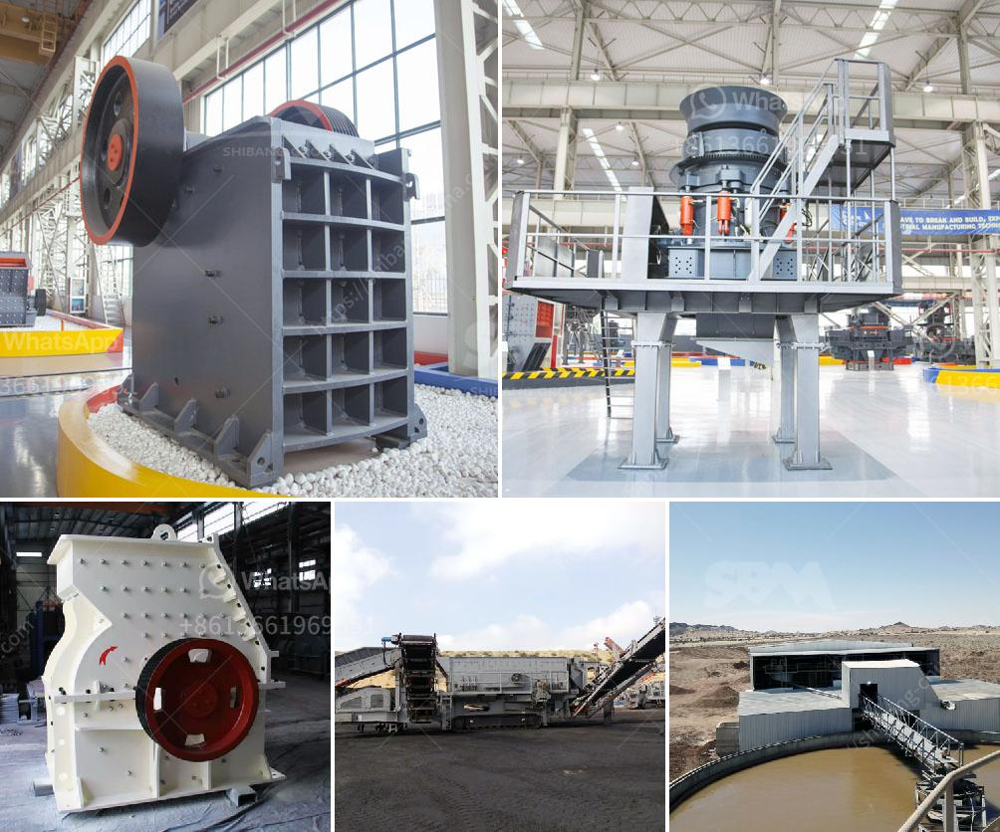

<h3>crusher for quick limestone plant</h3>
Limestone is a sedimentary rock that is mainly composed of calcium carbonate (CaCO3). It is formed from the remains of marine organisms such as coral and mollusks. Limestone is widely used in building materials, road construction, and many other industries. In order to meet the requirements of various applications, limestone needs to be crushed into smaller particles. This is where the crusher comes into play.

A crusher is a machine designed to reduce large rocks into smaller rocks, gravel, sand, or rock dust. It plays a crucial role in a limestone plant, as it is responsible for the final product size. Thanks to its strong and durable construction, a crusher can easily break down large limestone boulders into smaller, manageable sizes, allowing for easy transportation and further processing.

There are several types of crushers that can be used in a limestone plant, such as jaw crushers, impact crushers, and hammer crushers. Each type has its own unique features and advantages, making it suitable for specific applications.

Jaw crushers are commonly used as primary crushers in a limestone plant. They are designed to crush large rocks into smaller pieces by applying compressive force. These crushers have a movable jaw that exerts force on the rocks, breaking them apart. Jaw crushers are ideal for producing a uniform particle size and are known for their reliability and high production capacity.

Impact crushers, on the other hand, are used for secondary crushing. They are designed to crush rocks with the help of impact energy. These crushers use hammers or blow bars that rotate at a high speed, striking the rocks and causing them to break apart. Impact crushers are suitable for producing coarse to medium-sized particles and are often used in the construction industry.

Hammer crushers, also known as hammer mills, are another popular choice for limestone crushing. These crushers consist of a series of hammers mounted on a rotating shaft. The rocks are fed into the crusher and impacted or shattered by the rotating hammers. Hammer crushers are effective for producing fine particles and are commonly used in cement plants and aggregates production.

In addition to its primary crushing role, a crusher can also be used for further processing of limestone. For example, a secondary crusher can be used to produce smaller particles for use in road construction, while a tertiary crusher can produce even finer particles for applications such as plastering and paint.

When selecting a crusher for a quick limestone plant, it is important to consider factors such as the desired final product size, the capacity requirements, and the specific application. It is also essential to choose a crusher with robust construction and a reliable performance to ensure continuous operation and minimize downtime.

In conclusion, a crusher is an essential piece of equipment in a quick limestone plant. It allows for the efficient crushing of large limestone rocks into smaller, manageable sizes, making it suitable for various applications. Whether it is for primary, secondary, or tertiary crushing, a crusher plays a crucial role in the production process, ensuring high-quality limestone products.
<h3>Contact us</h3><ul><li><strong>Whatsapp:&nbsp;<a href="https://wa.me/8613661969651">+8613661969651</a></strong></li><li><a href="https://swt.shibang-china.com/?git&amp;zhl&amp;crusher for quick limestone plant"><strong>Online Service(chat now)</strong></a></li></ul><h3>Related</h3><ul><li><a href='jual stone crusher philippines.md'>jual stone crusher philippines</a></li><li><a href='jaw crushers in harare zimbabwe.md'>jaw crushers in harare zimbabwe</a></li><li><a href='crusher manufacturer in saudi.md'>crusher manufacturer in saudi</a></li><li><a href='second hand stone crushing plants india.md'>second hand stone crushing plants india</a></li><li><a href='sand and gravel crushers machine.md'>sand and gravel crushers machine</a></li></ul>