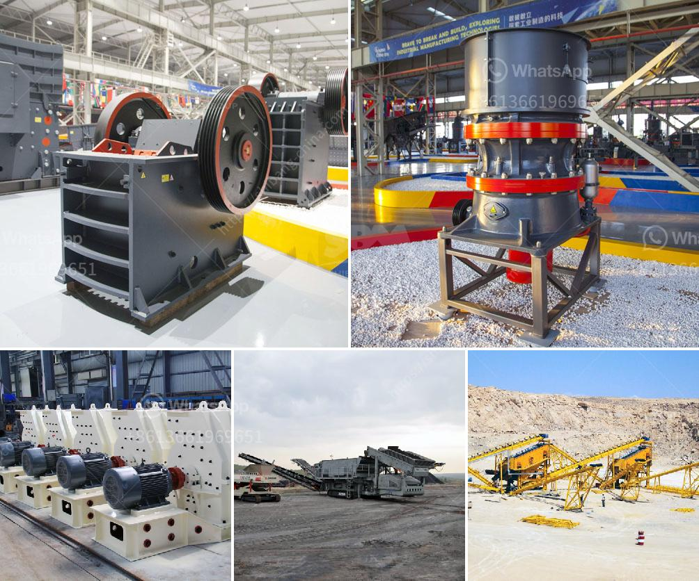

<h3>crusher for sale in kerala</h3>
Crushing is an essential process in any construction project, as it helps in reducing the size of stones, rocks, or any other materials. In the state of Kerala, where the real estate industry is booming, there is a huge demand for crushers of all types to facilitate various construction projects. Whether it is for building roads, bridges, or houses, crushers are essential equipment that helps in converting large-sized materials into smaller, manageable sizes.

One of the popular types of crushers for sale in Kerala is the cone crusher. While operating, this crusher ensures high productivity and reduces wear and tear. It has automatic overload protection and can be easily adjusted to achieve the desired output size. Cone crushers are typically used for secondary crushing and are suitable for processing a variety of materials, such as granite, limestone, river pebbles, and more.

Another type of crusher widely used in Kerala's construction industry is the jaw crusher. This crusher is ideal for primary crushing, ensuring the initial reduction of large-sized materials. Jaw crushers are reliable, robust machines that are designed to handle tough materials. They are known for their efficiency and have a simple structure, which makes maintenance hassle-free. These crushers are commonly used in various applications, including mining, metallurgy, construction, and recycling.

Furthermore, impact crushers are also popular choices in the state of Kerala. They are versatile machines that can efficiently crush a wide range of materials. Impact crushers use a striking force to break down materials and are designed to produce high-quality aggregates. These crushers are widely used in the construction industry for producing crushed stones of various sizes that are essential for concrete production and road development.

In addition to the different types of crushers, there are various sizes and models available for sale in Kerala. Some crushers are portable, allowing contractors to move them easily from one location to another. This flexibility is beneficial for construction projects that require crushing at multiple sites.

When searching for crushers for sale in Kerala, it is important to consider factors such as the capacity required, the type of material to be crushed, the desired output size, and the budget available. It is recommended to consult with reputable suppliers who can provide guidance and offer different options to meet specific project requirements.

In conclusion, crushers are essential equipment for construction projects in Kerala. Cone crushers, jaw crushers, and impact crushers are commonly used for crushing stones and rocks of various sizes. When purchasing a crusher, factors such as capacity, material type, output size, and budget should be considered. Consulting with trusted suppliers will help in finding the most suitable crusher for specific project requirements. With the availability of various options, contractors in Kerala can easily find crushers for sale that will enhance their productivity and contribute to the growth of the construction industry in the state.
<h3>Contact us</h3><ul><li><strong>Whatsapp:&nbsp;<a href="https://wa.me/8613661969651">+8613661969651</a></strong></li><li><a href="https://swt.shibang-china.com/?git&amp;zhl&amp;crusher for sale in kerala"><strong>Online Service(chat now)</strong></a></li></ul><h3>Related</h3><ul><li><a href='manufacturer of 30 80 mesh grinding plant.md'>manufacturer of 30 80 mesh grinding plant</a></li><li><a href='process of cement making.md'>process of cement making</a></li><li><a href='jaw crusher for sale in philippines.md'>jaw crusher for sale in philippines</a></li><li><a href='impact crusher machine price.md'>impact crusher machine price</a></li><li><a href='price hammer mill price mill pulverizer.md'>price hammer mill price mill pulverizer</a></li></ul>