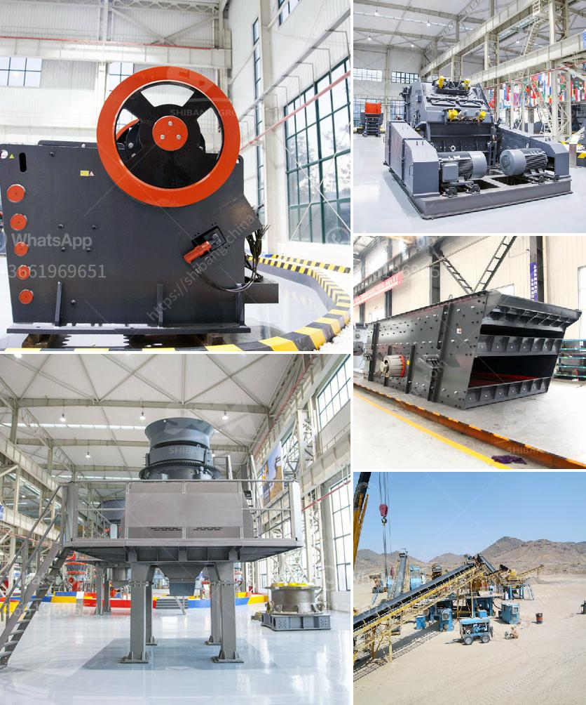

<h3>crusher for silicon quartz</h3>
Crusher for Silicon Quartz is a versatile material that is used in a variety of industries and applications. It offers significant benefits that make it ideal for crushing different types of materials.

Firstly, the crusher for silicon quartz reduces the size of the material without the need for secondary crushing. This is why it is often used in aggregate production and mining operations, among others. It is efficient and saves time and energy.

Secondly, the crusher for silicon quartz is designed with an advanced technology that ensures precise results. It guarantees uniformity in the particle size distribution, which is important for efficient processing and high-quality end products. This ensures that the silicon quartz is suitable for the desired application.

Additionally, the crusher for silicon quartz has a simple and robust construction, which minimizes maintenance needs. Its components are designed to withstand a high level of wear, making it a cost-effective and reliable option for crushing quartz.

Furthermore, the crusher for silicon quartz has a low energy consumption, which allows it to be an eco-friendly option in various industries. This is important for companies that aim to reduce their carbon footprint and minimize their impact on the environment.

Moreover, the crusher for silicon quartz has a high crushing ratio and production efficiency. It processes the material at a faster rate, resulting in higher productivity and increased profits for businesses. This is especially important for companies that rely on crushing quartz as part of their core operations.

Lastly, the crusher for silicon quartz can be easily adjusted to produce different sizes of crushed quartz. This flexibility makes it ideal for a wide range of applications, such as construction, road base, concrete additives, and decorative stones. It allows businesses to meet the specific requirements of their customers and adapt to changing market demands.

In conclusion, the crusher for silicon quartz is a versatile and efficient machine that is ideal for crushing different types of materials. It offers significant benefits that make it a preferred choice for many industries and applications. Its ability to reduce the size of the material without the need for secondary crushing, precise results, low energy consumption, robust construction, and high crushing ratio and production efficiency, make it an essential tool in various industries. Whether it is used in aggregate production or mining operations, the crusher for silicon quartz guarantees high-quality end products and cost-effective operations.
<h3>Contact us</h3><ul><li><strong>Whatsapp:&nbsp;<a href="https://wa.me/8613661969651">+8613661969651</a></strong></li><li><a href="https://swt.shibang-china.com/?git&amp;zhl&amp;crusher for silicon quartz"><strong>Online Service(chat now)</strong></a></li></ul><h3>Related</h3><ul><li><a href='chalk manufacturing machinechalk mining machinery.md'>chalk manufacturing machinechalk mining machinery</a></li><li><a href='river sand washing machine.md'>river sand washing machine</a></li><li><a href='find fine jaw crusher in china.md'>find fine jaw crusher in china</a></li><li><a href='small gold ore crusher grinder.md'>small gold ore crusher grinder</a></li><li><a href='ballast making machine kenya.md'>ballast making machine kenya</a></li></ul>