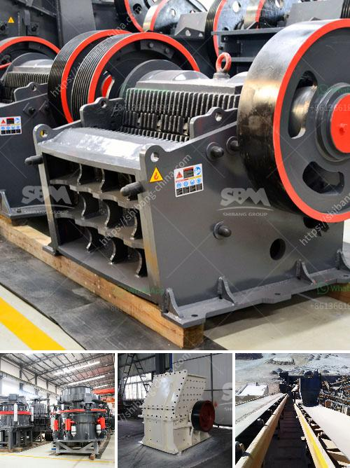

<h3>crusher grinder and sieving equipment kaolin</h3>
Kaolin, also known as China clay, is a versatile mineral that has been used for centuries in various industries such as ceramics, paper making, and cosmetics. With its unique properties, kaolin has gained popularity across different applications. However, in order to make the most of this valuable mineral, it needs to be processed into a fine powder, which requires the use of crusher, grinder, and sieving equipment.

Crusher, grinder, and sieving equipment are essential machinery for the kaolin processing. These machines have a vital role in the extraction of kaolin from the ore. Understanding their functions and importance is crucial for efficient processing.

The first step in kaolin processing is to excavate the raw kaolin ore. This is usually done with heavy machinery, such as bulldozers and excavators, which remove the earth and expose the kaolin deposit. Once the ore is extracted, it is transported to the processing plant for further operations.

The next stage involves crushing the kaolin ore into smaller particles. This is where the crusher equipment comes into play. The crusher is responsible for reducing the size of the ore to a manageable level, ensuring that it is suitable for the subsequent grinding process. Various types of crushers, such as jaw crushers, impact crushers, and cone crushers, are commonly used in the kaolin crushing process.

After crushing, the kaolin ore is further reduced in size through grinding. This process is essential to obtain the desired fine particle size, which enhances the properties of the kaolin powder. The grinder equipment is utilized for this purpose. It utilizes rotating grinding discs or stones to crush and grind the ore into a fine powder. Attrition mills, ball mills, and vertical roller mills are commonly used in the kaolin grinding process.

Once the kaolin ore is ground into a fine powder, it needs to be sieved to remove impurities and ensure uniformity. This is where the sieving equipment comes into play. The sieves or screens separate the kaolin particles based on their size. The use of sieving equipment helps achieve a consistent particle size distribution, which enhances the quality of the final kaolin product. Vibrating screens, rotary screens, and air classifiers are commonly used in the sieving process.

In conclusion, crusher, grinder, and sieving equipment are essential machinery in the kaolin processing industry. They play a critical role in the extraction, crushing, grinding, and sieving of kaolin ore, ultimately producing a fine powder that can be used in various industrial applications. The efficient utilization of these machines ensures the production of high-quality kaolin products.

As the demand for kaolin continues to rise, the need for advanced and efficient crusher, grinder, and sieving equipment becomes even more crucial. Manufacturers are continuously innovating and developing new technologies to optimize kaolin processing and improve productivity. The quality of kaolin products greatly depends on the performance of these machines, making them indispensable in the kaolin industry.
<h3>Contact us</h3><ul><li><strong>Whatsapp:&nbsp;<a href="https://wa.me/8613661969651">+8613661969651</a></strong></li><li><a href="https://swt.shibang-china.com/?git&amp;zhl&amp;crusher grinder and sieving equipment kaolin"><strong>Online Service(chat now)</strong></a></li></ul><h3>Related</h3><ul><li><a href='equipment needed for coal mining.md'>equipment needed for coal mining</a></li><li><a href='stone crusher in nairobi for sale.md'>stone crusher in nairobi for sale</a></li><li><a href='jaw crusher shanghai.md'>jaw crusher shanghai</a></li><li><a href='price for stone crusher machine.md'>price for stone crusher machine</a></li><li><a href='chrome crushing plant.md'>chrome crushing plant</a></li></ul>