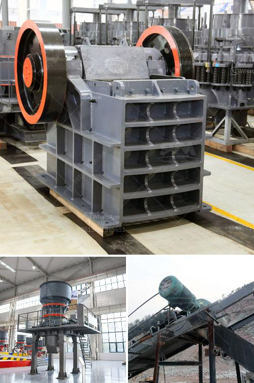

<h3>crusher in pakistan</h3>
The stone crushing industry in Pakistan is witnessing a boom due to increasing demand from the construction industry and the resultant increase in mining activities. The industry has been flourishing in the country ever since the government has embraced the concept of public-private partnership, allowing private companies to undertake mining activities and invest in modern machinery.

A crusher is a machine designed to reduce large rocks into smaller rocks, gravel, or rock dust. Crushers may be used to reduce the size, or change the form, of waste materials so they can be more easily disposed of or recycled, or to reduce the size of a solid mix of raw materials, so that pieces of different composition can be differentiated. Crushing is the process of transferring a force amplified by mechanical advantage through a material made of molecules that bond together more strongly, and resist deformation more, than those in the material being crushed do.

The use of crushers in the stone crushing industry has gained momentum in recent years due to the increasing need to process larger quantities of mineral ores and rocks in the construction field. Crushers are commonly used for crushing stones into desired sizes for various applications in infrastructure and building projects.

The crushers in Pakistan are located in various areas such as Khyber Pakhtunkhwa, Punjab, Sindh, Balochistan, and the Federal Capital Territory of Islamabad. These crushers are operating in highly regulated environments and are equipped with advanced technology to minimize dust emissions and noise pollution.

Investment in crushers in Pakistan has increased significantly over the years, as more and more private investors are attracted to this lucrative industry. The government has also provided various incentives and tax benefits to encourage investment in this sector. This has led to the establishment of several new crusher plants across the country, which are not only boosting the economy but also providing employment opportunities to local communities.

However, the stone crushing industry in Pakistan is not without its challenges. Environmental concerns, such as pollution and deforestation, are major issues that need to be addressed. The government and industry stakeholders must work together to develop and implement sustainable practices to mitigate the adverse impacts of stone crushing activities.

In conclusion, the crusher industry in Pakistan is witnessing significant growth and is becoming a major contributor to the country's economy. With proper regulation and sustainable practices, this sector can continue to flourish while minimizing its environmental footprint.
<h3>Contact us</h3><ul><li><strong>Whatsapp:&nbsp;<a href="https://wa.me/8613661969651">+8613661969651</a></strong></li><li><a href="https://swt.shibang-china.com/?git&amp;zhl&amp;crusher in pakistan"><strong>Online Service(chat now)</strong></a></li></ul><h3>Related</h3><ul><li><a href='gypsum powder uses in construction.md'>gypsum powder uses in construction</a></li><li><a href='industrial mills in mexico.md'>industrial mills in mexico</a></li><li><a href='machinery for bentonite crusher production.md'>machinery for bentonite crusher production</a></li><li><a href='cara menghitung biaya pemasangan stone crusher plant.md'>cara menghitung biaya pemasangan stone crusher plant</a></li><li><a href='pulveriser quartzite china make.md'>pulveriser quartzite china make</a></li></ul>