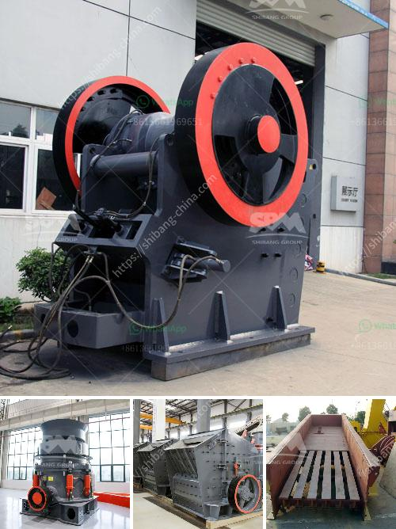

<h3>crusher machine ball media</h3>
In various industries where material grinding is a crucial manufacturing process, the use of crusher machine ball media plays a significant role in achieving the desired outcome. From mining to construction, processing raw materials requires efficient grinding, and the selection of the right media is vital for achieving optimal results. Let's take a closer look at crusher machine ball media and its importance in material grinding.

Crusher machines are widely used in industries like mining, construction, and recycling, where raw materials need to be reduced in size for further processing. These machines rely on ball media, which are spherical or cylindrical grinding media made from materials like steel, ceramic, or glass. The chosen ball media is loaded into the crushing chamber of the machine, where it collides with the raw material, transforming it into smaller particles.

The selection of the appropriate ball media is based on several factors such as the hardness and abrasiveness of the material, desired particle size, and machine specifications. For instance, harder and more abrasive materials require harder ball media to withstand the grinding process without excessive wear and tear. Likewise, a finer particle size may necessitate smaller ball media to achieve the desired outcome.

Efficient crushing machines incorporate a wide range of ball media sizes to facilitate different stages of material reduction. Coarser ball media, with larger diameters, are used for primary crushing, while finer ball media, with smaller diameters, are employed for tertiary grinding. By incorporating a variety of ball media sizes, manufacturers can ensure the appropriate level of grinding is carried out at each stage, maximizing overall efficiency.

In summary, crusher machine ball media are essential elements in the material grinding process. Properly selected ball media ensures efficient and effective reduction of raw materials. By considering factors such as material hardness, abrasiveness, desired particle size, and machine specifications, manufacturers can optimize their crushing machines and achieve the desired outcome with consistency. Whether it is in mining, construction, or recycling, crusher machines, with the right ball media, facilitate the production of finer materials crucial for countless industries.
<h3>Contact us</h3><ul><li><strong>Whatsapp:&nbsp;<a href="https://wa.me/8613661969651">+8613661969651</a></strong></li><li><a href="https://swt.shibang-china.com/?git&amp;zhl&amp;crusher machine ball media"><strong>Online Service(chat now)</strong></a></li></ul><h3>Related</h3><ul><li><a href='to buy a second hand mobile stone crusher plant india.md'>to buy a second hand mobile stone crusher plant india</a></li><li><a href='crushing of calcined bauxite.md'>crushing of calcined bauxite</a></li><li><a href='tanzania medical equipment supplier.md'>tanzania medical equipment supplier</a></li><li><a href='quarry plant equipment.md'>quarry plant equipment</a></li><li><a href='how does a jaw crusher limestone.md'>how does a jaw crusher limestone</a></li></ul>