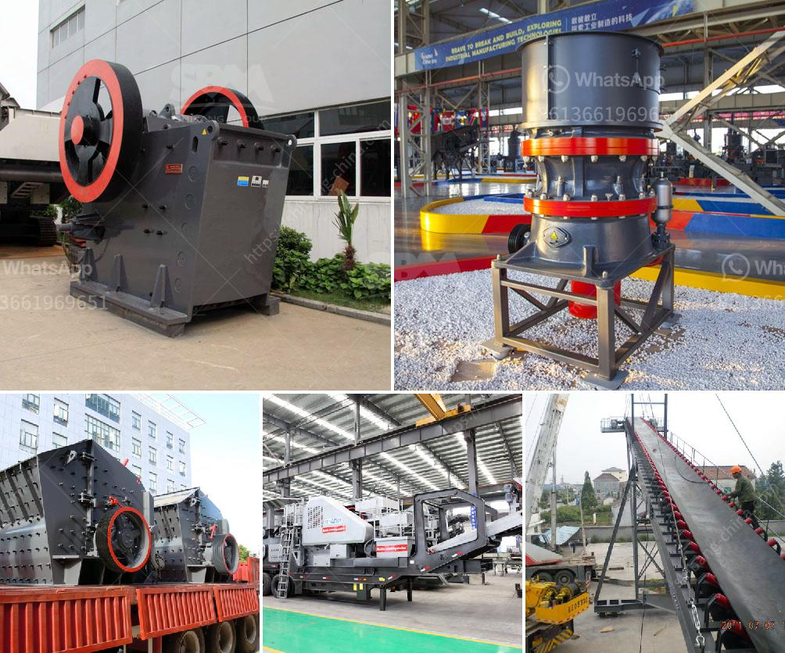

<h3>crusher machine for sale in pakistan</h3>
One of the advantages of using a crusher machine is that it reduces the size of large rocks or gravel to a smaller size, making it easier to transport and crush quickly. It does not require any energy from the user, making it easier to use compared to manual crushing machines. Moreover, one can save time and effort when using a crusher machine since it does not require the use of manual labor.

In Pakistan, there are various types of crusher machines that are available for sale. These include electric motor machines, gasoline-powered machines, and those that are operated by diesel engines. The electric motor machines are much cheaper compared to the other types, making them a more affordable option for most people. Additionally, one can find various brands and models of crusher machines in Pakistan, offering a wide range of choices suitable for different needs.

The crusher machines available in Pakistan are high in functionality and are able to crush stones and ores into fine particles. They are also able to break and separate different types of minerals from one another in a controlled environment. The use of these machines improves the efficiency and effectiveness of the entire crushing process, resulting in a higher production output.

One of the main applications of crusher machines in Pakistan is the crushing of coal. The country has abundant coal reserves, making it a highly attractive option for both local and international companies. In addition to coal, various other materials such as limestone, dolomite, gypsum, and shale are also suitable for crushing using these machines.

There are also several industries in Pakistan that heavily rely on crusher machines for their operations. For example, the construction industry requires a constant supply of crushed stones, gravel, and sand for the production of concrete and asphalt. Similarly, the mining industry requires a consistent supply of crushed rocks to extract valuable minerals from the earth.

When looking for a crusher machine for sale in Pakistan, one should only consider reputable suppliers. It is important to ensure that the machine has been manufactured with high-quality materials and meets all safety standards. Additionally, one should also consider the after-sales service offered by the supplier, as regular maintenance and servicing are necessary to keep the machine in good working condition.

In conclusion, a crusher machine is a useful tool in the process of crushing stones and other materials. It improves efficiency and effectiveness in various industries, such as construction and mining. In Pakistan, there are several options available for the purchase of crusher machines, including electric motor machines, gasoline-powered machines, and those that are operated by diesel engines. It is essential to choose a reputable supplier that offers high-quality machines and reliable after-sales service.
<h3>Contact us</h3><ul><li><strong>Whatsapp:&nbsp;<a href="https://wa.me/8613661969651">+8613661969651</a></strong></li><li><a href="https://swt.shibang-china.com/?git&amp;zhl&amp;crusher machine for sale in pakistan"><strong>Online Service(chat now)</strong></a></li></ul><h3>Related</h3><ul><li><a href='crushing plant in lahore.md'>crushing plant in lahore</a></li><li><a href='central shaft for stone crusher.md'>central shaft for stone crusher</a></li><li><a href='canber de broage ciment.md'>canber de broage ciment</a></li><li><a href='south africa gold processing equipment.md'>south africa gold processing equipment</a></li><li><a href='to 200 tph pe 750 1060 copper ore jaw crusher.md'>to 200 tph pe 750 1060 copper ore jaw crusher</a></li></ul>