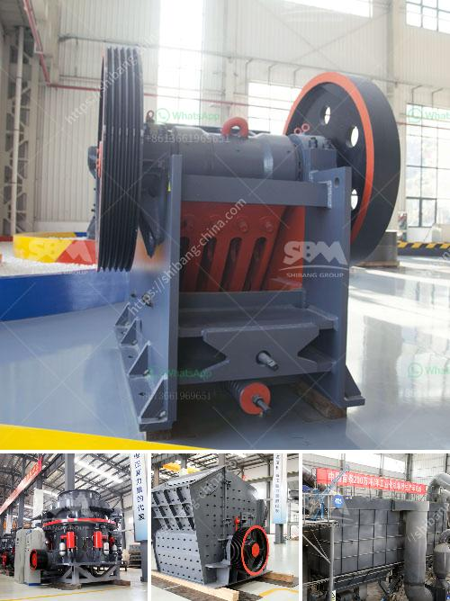

<h3>crusher machine philippines</h3>
One of the essential equipment in the mining and construction industries is the crusher machine. It is used to crush large rocks and stones into smaller pieces of uniform size or to turn the material into gravel. Crushing equipment is commonly used in the Philippines to break down materials such as granite, basalt, gravel, limestone, quartzite, marble, sandstone, pebbles, and other hard-rock ores.

The primary purpose of crushing machines is to reduce the size of materials for further processing. Crushers are used to process rock coal, iron ore, stone, and other similar materials. They are available in several types, including jaw crushers, gyratory crushers, cone crushers, impact crushers, roll crushers, and hammer mills. Each type is designed with different features to suit various applications.

One of the most popular types of crusher machines in the Philippines is the jaw crusher. Jaw crushers are used to crush rocks and stones into smaller sizes for further processing in the mining and construction industry. Jaw crushers are available in various sizes and models, making them perfect for different types of projects.

Gyratory crushers are also commonly used in the Philippines. This type of crusher machine is known for its high crushing efficiency, low maintenance, and reliable operation. It is used to crush rocks and stones for various applications, including mining, quarrying, and recycling.

Cone crushers are another type of crusher machine commonly used in the Philippines. They are used to crush medium-hard to hard rocks and ores. Cone crushers can operate at a fixed setting or with an adjustable setting. When adjusting the setting, operators can optimize the crusher's performance, allowing them to produce higher-quality aggregates.

Impact crushers are ideal for crushing soft to medium-hard materials, such as limestone, gypsum, and phosphate. These machines are commonly used in the construction industry to produce high-quality aggregates for concrete production.

Roll crushers and hammer mills are ideal for breaking down various materials, including coal, limestone, and brick. They are used in the mining industry to crush and grind materials into smaller sizes.

The crusher machine industry in the Philippines is growing intensely due to a high demand for building and construction materials. With the expansion of urban areas and infrastructure development projects, there is a greater need for aggregates to build roads, bridges, dams, and buildings.

Moreover, the mining industry is another key driver for the crusher machine market in the Philippines. The country is rich in mineral resources, including gold, copper, nickel, and chromite. These minerals need to be mined and processed using crusher machines. Crushing equipment plays a crucial role in extracting and processing these minerals.

In conclusion, the crusher machine Philippines is an essential equipment in the mining and construction industry. It is used to crush large rocks and stones into smaller pieces for further processing. Various types of crusher machines are available in the market to suit different applications. With the growing demand for construction materials and mining activities, the crusher machine industry in the Philippines is expected to continue to expand.
<h3>Contact us</h3><ul><li><strong>Whatsapp:&nbsp;<a href="https://wa.me/8613661969651">+8613661969651</a></strong></li><li><a href="https://swt.shibang-china.com/?git&amp;zhl&amp;crusher machine philippines"><strong>Online Service(chat now)</strong></a></li></ul><h3>Related</h3><ul><li><a href='dolomite powder machine.md'>dolomite powder machine</a></li><li><a href='jual jaw crusher second hand.md'>jual jaw crusher second hand</a></li><li><a href='hammer crusher parameters introduced in detail.md'>hammer crusher parameters introduced in detail</a></li><li><a href='price for stone crusher machine.md'>price for stone crusher machine</a></li><li><a href='canada gold mining equipment.md'>canada gold mining equipment</a></li></ul>