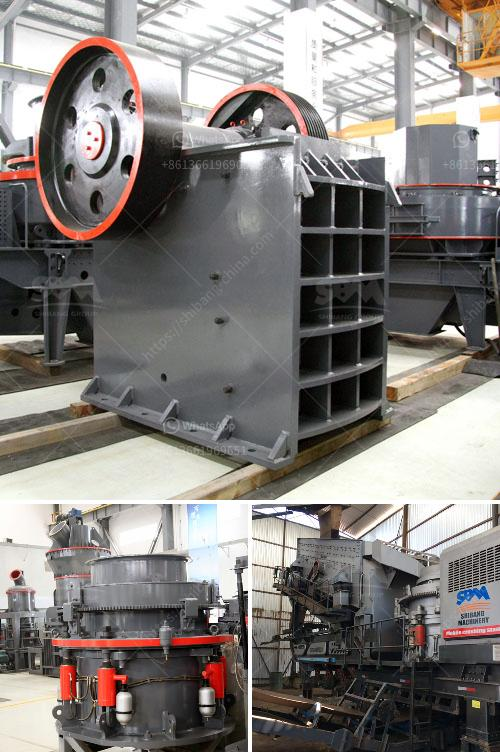

<h3>crusher machine plant in kenya price</h3>
A crusher machine is a machine designed to reduce large rocks into smaller rocks, gravel, or rock dust. As the world's leading manufacturer of crushing equipment, grinding equipment, beneficiation equipment, drying equipment, and briquetting equipment, we provide free installation, reasonable solutions, including quarries, aggregate yards, grinding yards, and complete factories. We offer a wide range of customized, affordable, and energy-efficient crusher machines plants in Kenya.

Kenya is one of the countries with a sound economic foundation in sub-Saharan Africa and the most developed country in East Africa. In recent years, Kenya has experienced various infrastructure projects, such as highway and railway construction projects. This has boosted the demand for gravel aggregates, sand products, and concrete products, creating enormous opportunities for the crusher machine plant in Kenya.

The crusher machine plant we provide includes fixed crushing plant and mobile crushing plant. The fixed crushing plant can be equipped with a vibrating feeder, a jaw crusher, a cone crusher, a impact crusher, a sand making machine, and even a sand washing machine, while the mobile crushing plant can be equipped with a jaw crusher, a cone crusher, a VSI crusher, a vibrating screen, a movable belt conveyor, and other auxiliary equipment.

The prices of our crusher machine plants are not fixed, but vary with the specific configurations and requirements of customers. The price range of our machines ranges from tens of thousands to hundreds of thousands of dollars. If you want to know the exact price of our crusher machine plant, you can contact our online customer service, who will provide you with a specific quotation according to your requirements.

Cost investment is one of the first considerations for customers. Compared with other manufacturers, our crusher machine plant in Kenya is reasonably priced, bringing customers the most benefits and investment returns. We have dedicated and professional technicians to answer customers' questions and provide guidance before sales, sales, and after-sales, ensuring customers' peace of mind and satisfaction.

In addition to price, quality is also a crucial factor to consider. Our crusher machine plants are manufactured with advanced technology and strict quality control standards. All parts and components are high-quality and highly wear-resistant materials, ensuring the crusher machine can work efficiently and stably under harsh conditions.

Furthermore, our crusher machine plants come with a warranty period and excellent after-sales service, which means any problems encountered during production and operation can be solved in a timely manner. We also provide free installation and training services to help customers quickly set up and start production, reducing downtime and increasing production efficiency.

Ultimately, investing in a crusher machine plant in Kenya is a wise choice for construction and infrastructure projects. The crusher machine plant can produce aggregate and concrete materials at a low cost, and improve the production efficiency and output. In conclusion, crusher machines play a vital role in the development of Kenya's infrastructure and economy.

To summarize, choosing a suitable crusher machine plant in Kenya requires considering factors such as price, quality, after-sales service, and technical support. We are committed to providing customers with the best solution and the most cost-effective crusher machine plants. Contact us today for more information and let us help you with your development goals in Kenya.
<h3>Contact us</h3><ul><li><strong>Whatsapp:&nbsp;<a href="https://wa.me/8613661969651">+8613661969651</a></strong></li><li><a href="https://swt.shibang-china.com/?git&amp;zhl&amp;crusher machine plant in kenya price"><strong>Online Service(chat now)</strong></a></li></ul><h3>Related</h3><ul><li><a href='sell plant crusher of stone.md'>sell plant crusher of stone</a></li><li><a href='price of stone crusher stone crusher.md'>price of stone crusher stone crusher</a></li><li><a href='graphite processing flowsheet.md'>graphite processing flowsheet</a></li><li><a href='quarry crusher equipment made in turkey.md'>quarry crusher equipment made in turkey</a></li><li><a href='used stone crusher for sale germany.md'>used stone crusher for sale germany</a></li></ul>