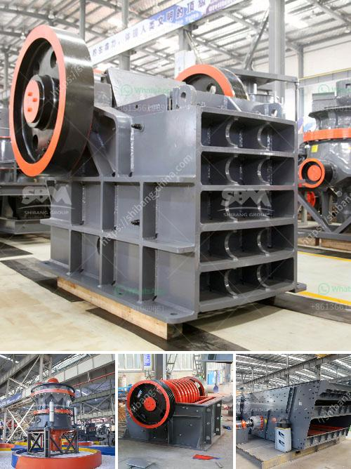

<h3>crusher machine price</h3>
When it comes to crushing equipment, finding the right machine at the right price is essential for any construction or mining project. However, with so many options available in the market, it can be challenging to determine which crusher machine offers the best value for money.

The price of crusher machines is influenced by several factors, including brand, model, capacity, and suppliers. With this in mind, let's explore the key aspects to consider when looking for affordable crusher machines without compromising on quality.

Opting for well-established brands that have built a solid reputation over the years is a smart move. Renowned brands often have reliable customer support, which can be crucial if you face any issues during the installation or operation of the crusher machine. While such brands may have higher initial prices, they often offer better quality and durability, resulting in a good return on investment in the long run.

Different models of crusher machines are designed for specific purposes, such as crushing rocks, stones, or minerals. It is essential to determine your project requirements and select a model that matches your needs. Consider factors like maximum feeding size, output size, and capacity to ensure the machine can handle the materials efficiently. It is advisable to choose a model that provides additional features like adjustable settings, advanced technology, and ease of maintenance.

The capacity of a crusher machine plays a crucial role in determining its price. Higher capacity machines are generally more expensive than those with lower capacity. Assess your project requirements carefully to determine the necessary capacity. While opting for a high-capacity machine may seem ideal for future expansion, it might not be a cost-effective solution if it exceeds your current requirements.

Working with reliable and reputable suppliers ensures you get the best quality machine at an affordable price. Look for suppliers who offer a wide range of crushers from reputed brands. It is recommended to seek quotations from multiple suppliers to compare prices and negotiate better deals. However, beware of suppliers offering extremely low prices as it may indicate compromised quality.

If you have budget limitations, buying a used crusher machine can offer a more affordable solution without compromising on quality. Used crushers, especially those maintained well, can provide similar performance to new ones at a significantly lower price. However, it is essential to inspect the machine thoroughly and verify its condition to ensure it meets your specifications.

When considering the price of a crusher machine, remember to account for additional costs like installation, transportation, and maintenance. These costs can vary depending on the machine size, complexity, and location. Ensure that you factor in all such expenses to determine the overall cost of the machine.

In conclusion, buying a crusher machine requires careful consideration of various factors to strike the right balance between price and quality. By prioritizing brand reputation, machine model, capacity, and supplier selection, you can find affordable options that perform optimally for your project needs. Remember to also consider used crushers as they can offer cost-effective alternatives without compromising on quality. With a well-researched purchase, you can ensure a successful and efficient crushing process for your construction or mining project.
<h3>Contact us</h3><ul><li><strong>Whatsapp:&nbsp;<a href="https://wa.me/8613661969651">+8613661969651</a></strong></li><li><a href="https://swt.shibang-china.com/?git&amp;zhl&amp;crusher machine price"><strong>Online Service(chat now)</strong></a></li></ul><h3>Related</h3><ul><li><a href='speed in rollal mill.md'>speed in rollal mill</a></li><li><a href='pulveriser quartzite china make.md'>pulveriser quartzite china make</a></li><li><a href='stone crusher machinery china.md'>stone crusher machinery china</a></li><li><a href='quarry crusher machines for sale.md'>quarry crusher machines for sale</a></li><li><a href='jaw crusher pe.md'>jaw crusher pe</a></li></ul>