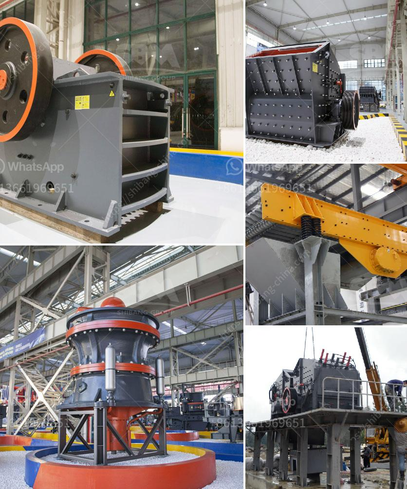

<h3>crusher manufacturer in pakistan</h3>
Crushers are machines designed to reduce large rocks into smaller rocks, gravel, or rock dust. Crushers can be used to reduce the size or change the form of materials, making them more manageable for easier disposal or recycling. One such industry that relies heavily on crushers is the mining industry.

Pakistan is blessed with abundant mineral resources, and producing crushed stone is an essential activity in the mining and construction industry. Stone crushing machinery is an important primary equipment used in the mining industry due to its versatility and durability.

Crusher manufacturers in Pakistan are focusing on design and development of crushing equipment to meet the increasing demand for different types of crushing machines. With the continuous growth of the construction industry and the increasing need for aggregate materials, crusher manufacturers are now focusing on introducing innovative technologies and offering competitive prices to remain ahead in the market.

In Pakistan, crusher manufacturers have established a strong foothold in both the domestic and international markets. They cater to various industries such as mining, construction, and infrastructure development. These manufacturers offer a wide range of crushers, including jaw crushers, impact crushers, cone crushers, and stone crushers.

The competition in the crusher manufacturing industry in Pakistan is fierce, and there are many domestic and foreign crusher manufacturers. As a leading manufacturer of crushing and screening equipment in Pakistan, Stone Crusher Pakistan provides high-quality machines with the latest technology for the construction industry.

Additionally, crusher manufacturers in Pakistan are also striving to enhance their after-sales services and spare parts availability to ensure a seamless experience for their customers. Timely maintenance and excellent customer support are crucial factors for the customers to choose a reliable crusher manufacturer.

In conclusion, crusher manufacturers in Pakistan play a vital role in the mining and construction industry. These manufacturers offer a wide range of crushing machines, ensuring timely delivery and excellent after-sales services. With the increasing demand for crushed stone, these manufacturers are continually striving to introduce innovative technologies and stay ahead in the market.
<h3>Contact us</h3><ul><li><strong>Whatsapp:&nbsp;<a href="https://wa.me/8613661969651">+8613661969651</a></strong></li><li><a href="https://swt.shibang-china.com/?git&amp;zhl&amp;crusher manufacturer in pakistan"><strong>Online Service(chat now)</strong></a></li></ul><h3>Related</h3><ul><li><a href='portable stone crusher plant.md'>portable stone crusher plant</a></li><li><a href='how to make fly ash.md'>how to make fly ash</a></li><li><a href='sand making production line.md'>sand making production line</a></li><li><a href='central shaft for stone crusher.md'>central shaft for stone crusher</a></li><li><a href='crusher price south africa.md'>crusher price south africa</a></li></ul>