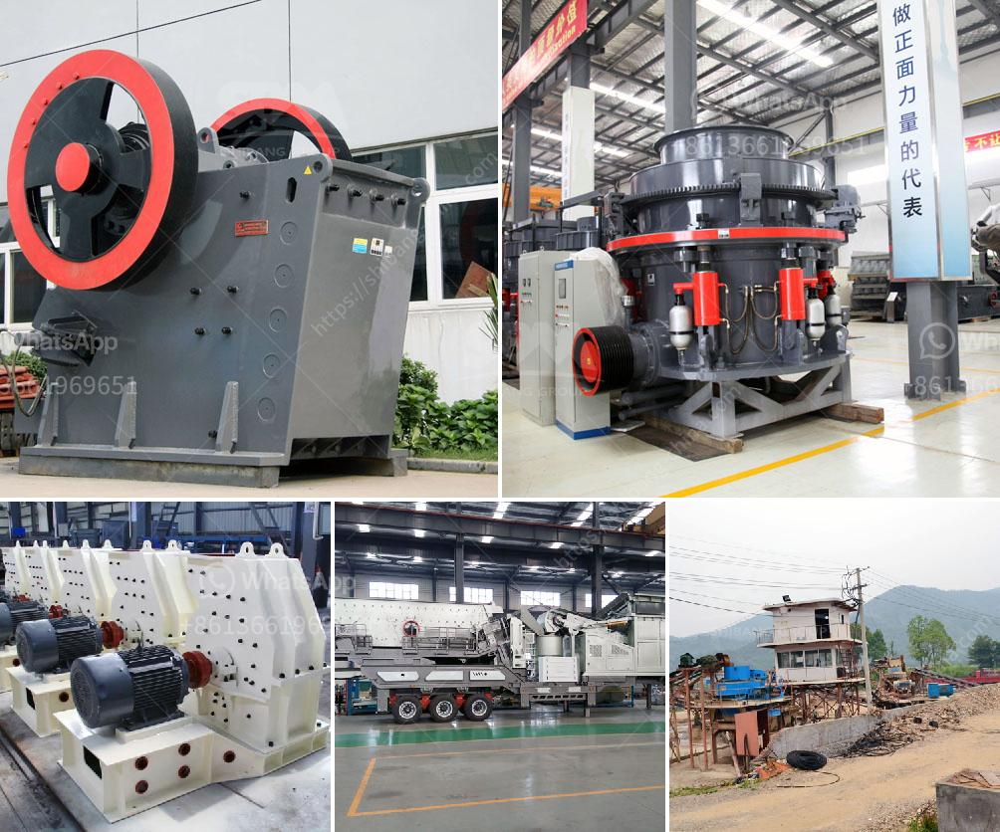

<h3>crusher manufacturer in saudi</h3>
Saudi Arabia is one of the world’s largest producers of petroleum products, making it a large player in the global energy industry. Despite being renowned for its immense oil reserves, Saudi Arabia has a thriving industrial sector that contributes to its economic diversification efforts. One of the key sectors within this industrial landscape is the crusher manufacturing industry. 

A crusher is a heavy machine designed to reduce large rocks into smaller rocks, gravel, or rock dust. Crushers may be used to reduce the size or change the form of waste materials so that they can be more easily disposed of or recycled or to reduce the size of a solid mix of raw materials. In Saudi Arabia, the demand for crushers is constantly on the rise due to the growth of the construction industry and investments in infrastructure projects. 

Several manufacturers offer a wide range of crushers in Saudi Arabia. These include jaw crushers, cone crushers, impact crushers, vibrating screens, and belt conveyors. All these crushers are manufactured by reputable companies from around the world, ensuring that the product is reliable and efficient. One such company that has been serving the Saudi Arabian market for over a decade is MB Crusher. 

MB Crusher is an Italian-based company that specializes in crushing and recycling equipment for construction sites. The company offers a complete range of crusher attachments, such as jaw crushers, cone crushers, impact crushers, and screening buckets, that are made to meet the specific needs of various construction projects. With MB Crusher's solutions, construction companies can reduce the amount of waste generated at construction sites and recycle materials directly on-site, thereby saving costs and minimizing the environmental impact. 

In addition to MB Crusher, other international manufacturers have also established their presence in Saudi Arabia. They include companies such as Sandvik, Metso, and Terex, which offer a wide range of crushers for various applications. These companies have extensive experience in the global market and have a strong reputation for delivering high-quality products. 

Saudi Arabia is not only a major market for crusher manufacturers but also an investment destination for these companies. The Saudi government has been actively promoting the growth of the industrial sector by offering incentives and setting up industrial zones. These initiatives have attracted several international manufacturers to set up their production facilities in Saudi Arabia. The local production of crushers helps meet the growing demand in the country while also supporting job creation and boosting the overall economy. 

In conclusion, the crusher manufacturing industry in Saudi Arabia is witnessing substantial growth due to the expansion of the construction industry and investments in infrastructure projects. Several reputable international manufacturers have established their presence in the country, offering a wide range of crushers to meet the diverse needs of various projects. This industry not only contributes to economic diversification but also supports the Kingdom's aim to reduce waste and promote sustainability.
<h3>Contact us</h3><ul><li><strong>Whatsapp:&nbsp;<a href="https://wa.me/8613661969651">+8613661969651</a></strong></li><li><a href="https://swt.shibang-china.com/?git&amp;zhl&amp;crusher manufacturer in saudi"><strong>Online Service(chat now)</strong></a></li></ul><h3>Related</h3><ul><li><a href='using mobile jaw crusher.md'>using mobile jaw crusher</a></li><li><a href='cheap concrete crusher sale kenya.md'>cheap concrete crusher sale kenya</a></li><li><a href='jual crusher batubara di indonesia.md'>jual crusher batubara di indonesia</a></li><li><a href='price of a set of stone crushing machine.md'>price of a set of stone crushing machine</a></li><li><a href='mtm 160 ball mill spare parts suppliers in india.md'>mtm 160 ball mill spare parts suppliers in india</a></li></ul>