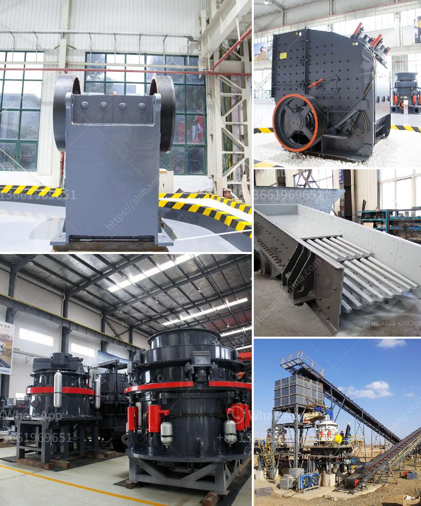

<h3>crusher manufacturer in</h3>
Crushers are heavy machinery equipment designed to reduce the size of large rocks or gravel for construction purposes. They are commonly used in mining, metallurgical, and building material industries to crush solid materials into smaller particles for further processing.

A crusher manufacturer is a company that produces various types of crushers. These machines are designed to tackle a wide range of materials, including rocks, ores, and other aggregates. They are available in different sizes and capacities to meet the specific requirements of different industries.

One of the key advantages of partnering with a reputable crusher manufacturer is accessing high-quality and durable equipment. These manufacturers invest heavily in research and development to improve the efficiency and performance of their crushers. They use advanced technologies and innovative designs to ensure their machines deliver optimal results.

Furthermore, crusher manufacturers often provide customization options to meet the specific needs of their customers. They can tailor the crushers to handle different materials, process requirements, and operating conditions. This flexibility allows industries to choose the most suitable crusher for their operations, maximizing productivity and reducing downtime.

Additionally, crusher manufacturers typically offer comprehensive after-sales services, including maintenance, repairs, and spare parts availability. This ensures that customers can rely on their equipment for a long time, minimizing disruptions to their operations and maximizing profitability.

It is essential to choose a reliable and experienced crusher manufacturer to ensure the best performance and value for money. Conducting thorough research, considering customer reviews, and evaluating the manufacturer's reputation are critical when making a selection.

In conclusion, crusher manufacturers play a crucial role in the construction and mining industries by providing high-quality equipment that efficiently crushes various materials. Working with a reputable manufacturer ensures access to durable and customized crushers, as well as comprehensive after-sales services. These factors contribute to increased productivity and profitability for businesses in need of crushing solutions.
<h3>Contact us</h3><ul><li><strong>Whatsapp:&nbsp;<a href="https://wa.me/8613661969651">+8613661969651</a></strong></li><li><a href="https://swt.shibang-china.com/?git&amp;zhl&amp;crusher manufacturer in"><strong>Online Service(chat now)</strong></a></li></ul><h3>Related</h3><ul><li><a href='cement unit cost for 150 tons.md'>cement unit cost for 150 tons</a></li><li><a href='used silica sand washing plant for sale.md'>used silica sand washing plant for sale</a></li><li><a href='track mobile crusher.md'>track mobile crusher</a></li><li><a href='hydraulic system vertical roller mill.md'>hydraulic system vertical roller mill</a></li><li><a href='prices of cement clinker grinding unit in india.md'>prices of cement clinker grinding unit in india</a></li></ul>