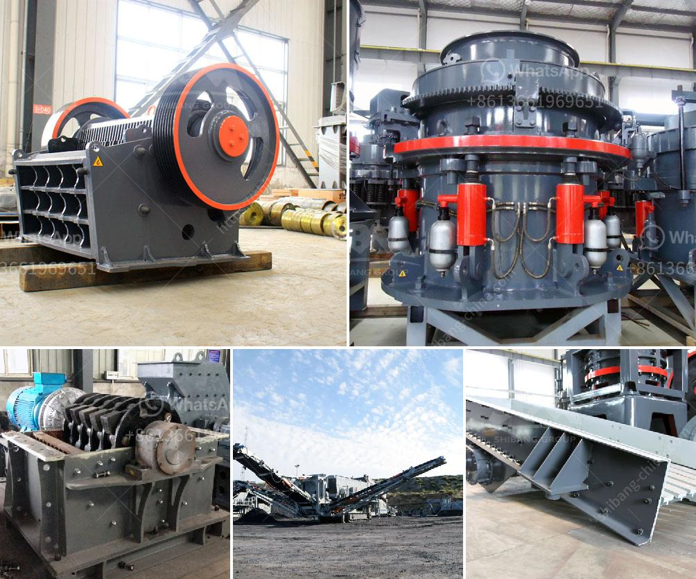

<h3>crusher manufacturing companies in hong kong</h3>
Hong Kong, known for its towering skyscrapers and bustling cityscape, has seen a surge in construction projects in recent years. With this boom in the construction industry, the demand for crushers has also increased, leading to the establishment of several crusher manufacturing companies in the region. These companies play a crucial role in providing the necessary equipment to meet the growing needs of the industry.

One of the key players in the crusher manufacturing industry in Hong Kong is XYZ Crushers. With over two decades of experience, XYZ Crushers has established itself as a leading manufacturer, providing innovative and efficient crushing solutions to the construction sector. Their wide range of crushers, including jaw crushers, cone crushers, and impact crushers, cater to various construction requirements, from demolishing concrete structures to processing aggregates for road construction.

Another prominent crusher manufacturing company in Hong Kong is ABC Industries. With a focus on sustainability, ABC Industries has developed crushers that promote environmental consciousness by reducing noise and dust emissions. These crushers are not only efficient in performance but are also designed with ergonomic features for the safety and comfort of the operators.

The crusher manufacturing industry in Hong Kong is characterized by fierce competition and a drive for innovation. Companies are constantly investing in research and development to enhance the performance and durability of their crushers. This commitment to innovation has led to the introduction of advanced features like automated settings, remote monitoring, and intelligent control systems, which improve operational efficiency and reduce downtime.

To cater to the diverse needs of the construction industry, crusher manufacturing companies in Hong Kong also offer customized solutions. They collaborate closely with their clients to understand their specific requirements, ensuring that the crushers are tailored to meet their unique needs.

In conclusion, crusher manufacturing companies in Hong Kong are at the forefront of driving innovation in the construction industry. With their advanced and customized crushing solutions, they play a significant role in meeting the growing demands of the industry while ensuring sustainability and environmental consciousness. As the construction industry continues to grow, these companies will continue to evolve and provide groundbreaking solutions to support the development of Hong Kong's infrastructure.
<h3>Contact us</h3><ul><li><strong>Whatsapp:&nbsp;<a href="https://wa.me/8613661969651">+8613661969651</a></strong></li><li><a href="https://swt.shibang-china.com/?git&amp;zhl&amp;crusher manufacturing companies in hong kong"><strong>Online Service(chat now)</strong></a></li></ul><h3>Related</h3><ul><li><a href='gold hammer mill used for sale in zimbabwe.md'>gold hammer mill used for sale in zimbabwe</a></li><li><a href='grinding equipment and machinery.md'>grinding equipment and machinery</a></li><li><a href='21 10 jaw crusher price in south afirca.md'>21 10 jaw crusher price in south afirca</a></li><li><a href='stone crushing machine manufacturers in japan.md'>stone crushing machine manufacturers in japan</a></li><li><a href='cost quarry machines.md'>cost quarry machines</a></li></ul>