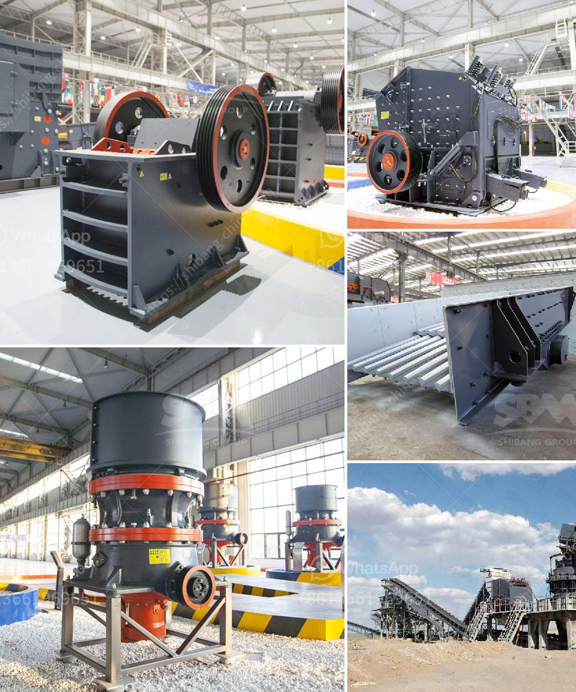

<h3>crusher plant saudi</h3>
Crusher plant, a Saudi investment in the ever-expanding construction industry, has become a vital part of a successful mining operation in the Kingdom. Located in the mountainous region of Saudi Arabia, the plant has been providing high-quality aggregates for various construction projects, including infrastructure development, commercial buildings, and residential communities.

One of the primary advantages of the crusher plant is its versatility. It can effectively crush a wide range of materials, including limestone, granite, and basalt, into various sizes of aggregate. This flexibility allows contractors and builders to meet the unique demands of different construction projects and deliver the desired specifications.

In addition to supplying high-quality aggregates, the crusher plant also plays a significant role in environmental sustainability. By processing construction waste, such as concrete and demolition debris, the plant reduces the amount of material that ends up in landfills. Instead, these materials are recycled and transformed into useful resources, reducing the environmental impact of construction activities.

Moreover, the crusher plant promotes local economic growth by creating job opportunities. It requires a skilled workforce to operate and maintain the plant, ensuring a steady income for individuals in the community. Additionally, the plant supports the local economy by sourcing construction materials and services from nearby suppliers, further stimulating economic activity.

The crusher plant Saudi is equipped with advanced technology and machinery to ensure efficient and cost-effective operations. State-of-the-art crushers and screens enable the plant to produce superior quality aggregates that meet the strictest industry standards. Automation and digitalization streamline the production process, improving productivity and minimizing downtime.

Safety is a top priority for the crusher plant Saudi. Strict safety protocols and procedures are implemented to ensure a safe working environment for all employees. Regular training programs and continuous monitoring help prevent accidents and promote a culture of safety awareness among the workforce.

Crusher plant Saudi is also committed to corporate social responsibility. It actively participates in community development initiatives and supports local educational programs and healthcare facilities. By investing in the well-being of the community, the plant strives to create a positive and sustainable impact beyond its operational boundaries.

In conclusion, the crusher plant Saudi has become an integral part of the construction industry in the Kingdom. It provides high-quality aggregates, promotes environmental sustainability, contributes to local economic growth, ensures safety, and demonstrates corporate social responsibility. As Saudi Arabia continues to invest in infrastructure development, the crusher plant will play a crucial role in meeting the growing demand for construction materials, supporting the Kingdom's vision for a prosperous future.
<h3>Contact us</h3><ul><li><strong>Whatsapp:&nbsp;<a href="https://wa.me/8613661969651">+8613661969651</a></strong></li><li><a href="https://swt.shibang-china.com/?git&amp;zhl&amp;crusher plant saudi"><strong>Online Service(chat now)</strong></a></li></ul><h3>Related</h3><ul><li><a href='slag crusher plant india.md'>slag crusher plant india</a></li><li><a href='industrial rock crusher.md'>industrial rock crusher</a></li><li><a href='pulveriser manufacturer in shanghai.md'>pulveriser manufacturer in shanghai</a></li><li><a href='coal crusher infomation requirments.md'>coal crusher infomation requirments</a></li><li><a href='vibratory screen south africa.md'>vibratory screen south africa</a></li></ul>