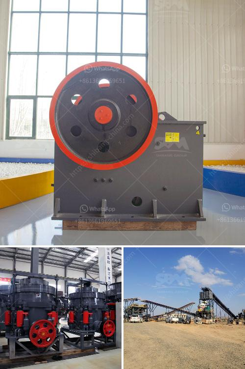

<h3>crusher plant supplier</h3>
In the modern construction industry, the demand for quality aggregate materials is on the rise. Whether it is road construction, building construction, or infrastructure development, the need for crushed stone, gravel, and sand is essential. This is where a reliable crusher plant supplier becomes crucial to meet these demands.

A crusher plant is a machine designed to reduce the size of various stones and rocks to smaller sizes. It is used in construction, mining, and other industries to facilitate the breaking down process of larger rocks into smaller pieces. The crushed material serves as the foundation for roads, bridges, buildings, and many other structures.

Selecting the right crusher plant supplier is of utmost importance as it determines the quality of the final product you receive. Here are some factors to consider when looking for a reputable supplier:

Opt for a supplier with a proven track record in the industry. A supplier with years of experience can provide you with expert advice, high-quality products, and reliable service. Check their online presence, customer reviews, and industry reputation before making a decision.

Look for a supplier that offers a wide range of crusher plants to meet your specific needs. Different types of crushers, such as jaw crushers, cone crushers, or impact crushers, cater to different requirements. A supplier with a comprehensive range allows you to choose the most suitable equipment for your needs.

Ensure that the supplier provides high-quality crusher plants that are reliable, durable, and efficient. Innovation in design and technology can enhance the productivity and performance of the equipment, leading to better results in your crushing operations.

Consider a supplier that offers adequate after-sales support. This includes technical assistance, spare parts availability, and maintenance services. Timely support ensures minimal downtime in case of any issues, allowing you to maximize your productivity.

While price shouldn't be the sole determining factor, it is essential to find a supplier that offers competitive pricing. Compare the prices of different suppliers while considering their product quality, warranty, and after-sales support. A supplier that offers a balance of quality and affordability provides the best value for your investment.

When it comes to finding the right crusher plant supplier, investing time and effort in research is crucial to ensure you make an informed decision. A reliable supplier can provide you with high-quality crusher plants, offering excellent performance, durability, and reliability. Their expertise and support will contribute to your overall success in the construction industry. So, take the time to evaluate different suppliers, their product range, after-sales support, and pricing to find the perfect partner for your crushing needs.
<h3>Contact us</h3><ul><li><strong>Whatsapp:&nbsp;<a href="https://wa.me/8613661969651">+8613661969651</a></strong></li><li><a href="https://swt.shibang-china.com/?git&amp;zhl&amp;crusher plant supplier"><strong>Online Service(chat now)</strong></a></li></ul><h3>Related</h3><ul><li><a href='listing price tons per hour screw conveyor.md'>listing price tons per hour screw conveyor</a></li><li><a href='stone crusher plant manufacturer.md'>stone crusher plant manufacturer</a></li><li><a href='crusher prices stone crusher primary and secondary.md'>crusher prices stone crusher primary and secondary</a></li><li><a href='portable crushing and screening plant.md'>portable crushing and screening plant</a></li><li><a href='station de concasassage theniet elhad.md'>station de concasassage theniet elhad</a></li></ul>