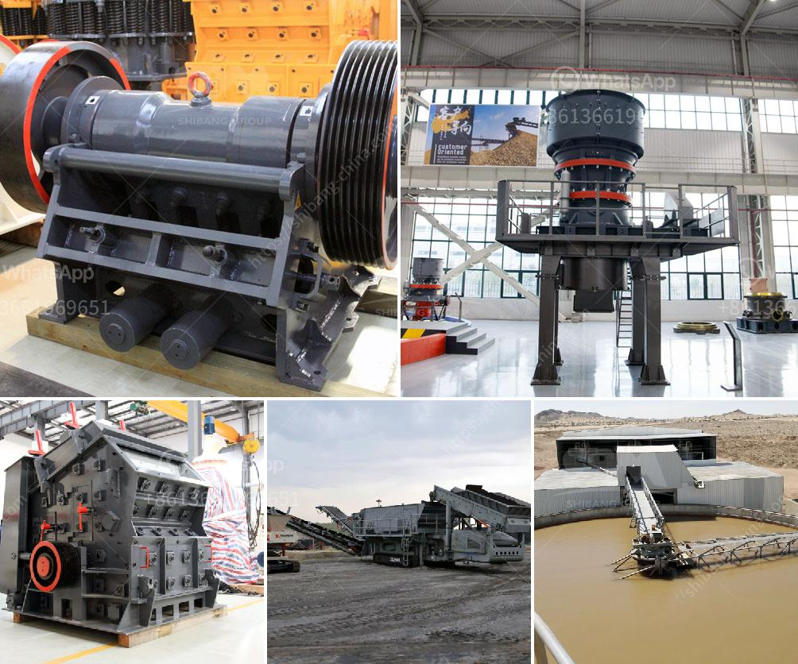

<h3>crusher plants in sri lanka</h3>
Crusher plants are essential in the construction industry and are specifically designed to break down rocks into smaller-sized aggregates for use in various construction projects. In Sri Lanka, crusher plants have been established to cater to the growing need for construction materials, particularly aggregates.

As the population grows and cities develop, the demand for construction materials increases, making crusher plants an invaluable asset in the construction industry. These plants play a vital role in supplying aggregates needed for various projects like roads, bridges, buildings, and dams.

One of the primary advantages of crusher plants is their ability to produce aggregates of different sizes and shapes. This versatility allows projects to select the appropriate size of aggregates required for their specific needs. It also helps in reducing transportation costs and wastage as aggregates can be produced on-site.

Furthermore, crusher plants promote sustainable development by reducing the need for natural resources. Instead of sourcing aggregates from river beds or digging up mountains, crusher plants use rocks and stones available locally. This practice helps to conserve natural resources and minimizes the environmental impact caused by excessive mining.

In addition to their environmental benefits, crusher plants also contribute to the economic development of Sri Lanka. These plants provide employment opportunities for the local communities, generating income and improving their quality of life. The construction industry, fueled by the availability of high-quality aggregates from crusher plants, also boosts the country's GDP by attracting investments and contributing to the overall economic growth.

Crusher plants in Sri Lanka are typically located in the vicinity of major construction projects or along major highways, where they can easily provide a steady supply of aggregates. Some popular locations for crusher plants include Hambantota, Trincomalee, and Colombo. These areas see high construction activity and have a consistent demand for aggregates, making them ideal locations for crusher plants.

However, operating a crusher plant comes with some challenges. The operation has to comply with local regulations and environmental standards to ensure the safety of workers and minimize its impact on the environment. Regular maintenance of the machinery is also crucial to ensure smooth operations and avoid unexpected breakdowns.

To overcome these challenges, most crusher plants in Sri Lanka are equipped with advanced technology and efficient machinery. These plants incorporate state-of-the-art crushers, screens, and conveyors to optimize the production process. Additionally, modern pollution control systems are implemented to minimize dust emissions and noise pollution.

In conclusion, crusher plants in Sri Lanka play a significant role in fulfilling the growing demand for construction materials. They provide high-quality aggregates, contribute to sustainable development, and boost economic growth. However, proper management and adherence to environmental standards are essential to ensure the long-term success and sustainability of these plants. By incorporating advanced technology and following best practices, crusher plants in Sri Lanka can continue to support the development of the country's infrastructure while minimizing their impact on the environment.
<h3>Contact us</h3><ul><li><strong>Whatsapp:&nbsp;<a href="https://wa.me/8613661969651">+8613661969651</a></strong></li><li><a href="https://swt.shibang-china.com/?git&amp;zhl&amp;crusher plants in sri lanka"><strong>Online Service(chat now)</strong></a></li></ul><h3>Related</h3><ul><li><a href='stones crushing into building sand.md'>stones crushing into building sand</a></li><li><a href='crusher unit and quarry land for sale.md'>crusher unit and quarry land for sale</a></li><li><a href='stone crusher in nairobi for sale.md'>stone crusher in nairobi for sale</a></li><li><a href='quarry crusher machines for sale.md'>quarry crusher machines for sale</a></li><li><a href='jaw crusher plant for sale.md'>jaw crusher plant for sale</a></li></ul>