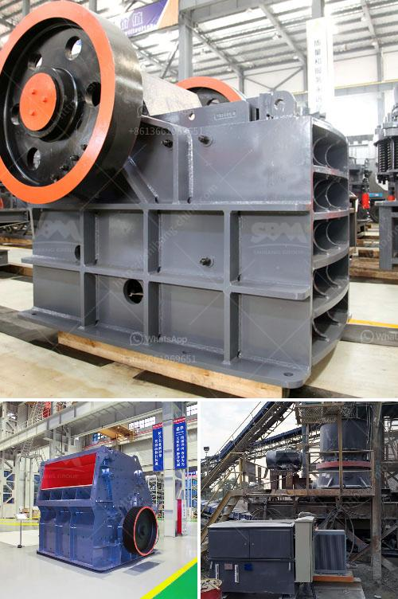

<h3>crusher price in nepal</h3>
The price of crushers in Nepal varies depending on several factors such as the type, size, capacity, and brand. Crushers are essential industrial equipment that are used to break down large rocks and stones into smaller particles for various construction purposes. They are widely used in the mining, quarrying, and construction industries in Nepal.

The price range for crushers in Nepal is quite diverse. Basic jaw crushers are available at a starting price of around NPR 500,000 and can go up to NPR 2 million or more, depending on the size and capacity. The prices of cone crushers range from NPR 2.5 million to NPR 10 million or more. Impact crushers, which are used for crushing rocks and producing fine aggregates, can cost anywhere from NPR 3 million to NPR 15 million.

Several factors influence the price of crushers in Nepal. Firstly, the size and capacity of the crusher play a significant role. Crushers with larger capacities and higher outputs generally have higher price tags. Additionally, the brand of the crusher can also impact the price, as well-known and trusted brands tend to be more expensive.

Moreover, the demand and supply dynamics of crushers in Nepal also affect their prices. If there is a higher demand for crushers and a limited supply, the prices are likely to be higher. Conversely, if there is an oversupply of crushers, the prices may be more competitive.

It is important for potential buyers to consider their specific requirements and budget before purchasing a crusher. They should also research and compare prices from different suppliers and brands to ensure they get the best value for their money. Additionally, proper maintenance and regular servicing of crushers can help prolong their lifespan and ensure optimal performance.

In conclusion, the price of crushers in Nepal can vary significantly depending on factors such as size, capacity, brand, demand, and supply. Potential buyers should carefully consider their needs and budget before investing in a crusher. Comparing prices from different suppliers and brands is advisable to get the best deal. Proper maintenance and servicing are also important for the longevity of crushers.
<h3>Contact us</h3><ul><li><strong>Whatsapp:&nbsp;<a href="https://wa.me/8613661969651">+8613661969651</a></strong></li><li><a href="https://swt.shibang-china.com/?git&amp;zhl&amp;crusher price in nepal"><strong>Online Service(chat now)</strong></a></li></ul><h3>Related</h3><ul><li><a href='different crushed stones in nigeria.md'>different crushed stones in nigeria</a></li><li><a href='granite crusher plant.md'>granite crusher plant</a></li><li><a href='feasibility study quartz stone.md'>feasibility study quartz stone</a></li><li><a href='gypsum crushing machine.md'>gypsum crushing machine</a></li><li><a href='primary and secondary crusher.md'>primary and secondary crusher</a></li></ul>